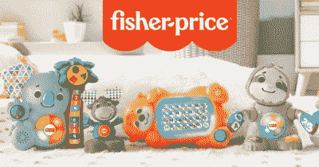
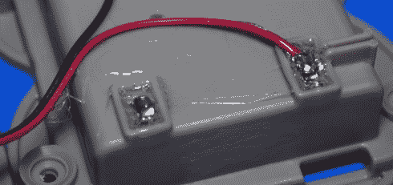
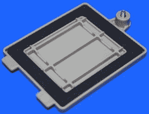
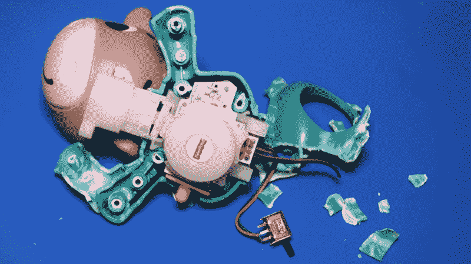
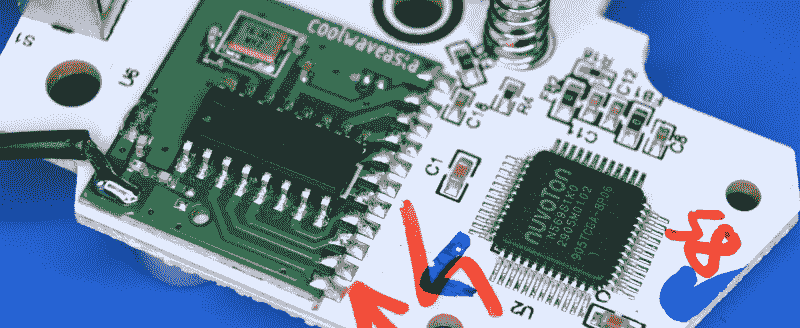
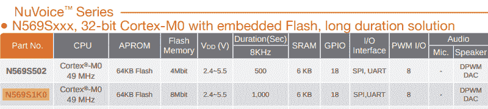
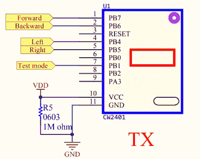
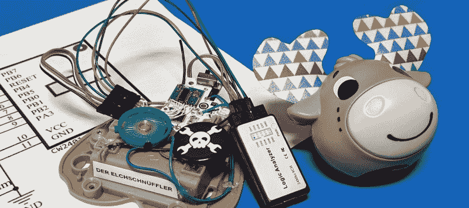
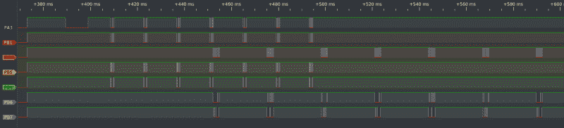

# 拆卸:Linkimals 音乐驼鹿

> 原文：<https://hackaday.com/2021/04/13/teardown-linkimals-musical-moose/>

像如今许多消费品一样，婴儿玩具似乎一年比一年复杂。尽管事实上，一般的幼儿往往会完全被一个简单的纸箱所吸引，但玩具公司显然是不顾一切地生产电池供电的装置，需要获得联邦通信委员会的许可。

作为一个完美的例子，我们有费雪-普莱斯的 Linkimals。这些友好的生物可以通过唱歌和闪烁集成的 RGB LEDs 来独立操作，以响应按钮的按下，但如果将它们中的几个聚集在一起，它们的 2.4 GHz 无线电就会产生即兴的网状网络乐趣。

They’ll soon be back, and in greater numbers.

一旦相互连接，这些数码生物就会同步它们的发光二极管并齐声歌唱。你两岁的孩子会注意到吗？我知道我的肯定不会。但这确实是一个引人注目的广告，当你卖儿童玩具时，这真的是最重要的事情。

在我们一位亲爱的读者的建议下，我拿起一部二手的 Linkimals 音乐剧《驼鹿》,近距离观察这个可爱的朋友是如何运作的。虽然事后看来，我并不真的需要；在亚马逊上快速浏览一下就会发现，尽管这些小家伙内部都是高科技，但价格却出奇的便宜。事实上，我有点不好意思地承认，鉴于它目前的零售价不到 10 美元，我实际上为我的二手驼鹿付出了更多。

但你不是来看我在财政上的不负责任的，你想看一个拟人化的林地生物被解剖。所以让我们把这个自鸣得意的驼鹿拆开，看看里面是什么。

## 婴儿工程

由于这是我们在这个连续拆解系列中看到的第一个为真正的婴儿设计的小玩意，值得注意的是这个领域的一些小细节。驼鹿身上没有尖角，几个可见的螺丝钉已经深深地嵌入塑料中，即使是最好奇的年轻人也无法将它们取出。

    

有趣的是，电池盒通过门周围的大量垫圈和顶部端子穿过塑料的密封剂而不透液体。记住，这个玩具不能靠近水。那么，这是为了不让唾液进入内部运作，还是为了确保爆裂的碱性电池不会进入孩子的嘴里？当与这个年龄的用户打交道时，也许两者都有一点。

Pro Tip: Don’t try this on a toy your child actually plays with.

不幸的是，事实证明这种构造方法并不完全有利于非破坏性拆卸。虽然音乐驼鹿的脚和头没有任何问题，但所有电子产品所在的身体本身似乎被永久密封了。我用尽各种撬具，就是打不开这东西。最终，我不得不开始切割塑料，最终露出了将身体的两半固定在一起的八个钉子。我不确定它们是用胶水粘起来的还是用超声波焊接起来的，但最终结果是一样的:对于任何可能走到长凳上的小孩来说，这都是一个非常令人伤心的场景。

## 一个~~一个~~两个芯片解决方案

鉴于这款玩具的价格低得令人难以置信，我原本预计在内部至少会看到一些黑色环氧树脂斑点，但事实却更有趣。除了一个 RGB LED、一个按钮和一些无源器件，Musical Moose PCB 上只有两个组件。其中一个虽然完全没有任何标记，但显然是收音机。另一个是 Nuvoton 专门为像这样的通话设备设计的迷人的一体化解决方案。

Nuvoton N569S1K0 是一款 ARM Cortex-M0 32 位微控制器，运行频率为 49 MHz，具有 6 kB RAM 和 64 kB ROM。作为该公司 NuVoice 系列芯片的一部分，它还具有 1 MB 的音频数据内部存储空间。根据规格表，这允许单个芯片保存近 17 分钟的语音剪辑。请注意，质量不是特别高，但对于一个会说话的玩具来说已经足够好了。

很明显，带有天线引线的焊接模块是收音机，但除了丝印上的 Coolwaveasia 之外，没有任何东西可以识别它。搜索名称，我们可以看到它是 Coolwave Communications 的产品，浏览他们的网站甚至可以看到一些非常相似的模块，但它们似乎都没有公开的数据表。

## 无线电研究

当拆卸廉价的无线设备时，焊接在无线电模块上是一个常见的景象，因为它使设计者不必考虑事物的射频方面。但是没有数据手册，很难说我们在这里看到的是什么。这个芯片只是一个简单的收音机，还是它自己的一个微控制器？毕竟，来回传递几个字节的数据需要很多引脚。不幸的是，没有更多的信息，这是线索往往会变冷。

The only good to come from the *Jurassic World* franchise.

但这次不是。经过一番搜索，我找到了一个联邦通信委员会的条目[侏罗纪世界*“猛禽攻击吉普车”*](https://fccid.io/PIYFNH12-17A5T)*似乎使用了相同的无线电模块。仅此一点不会有太大帮助，但与绝大多数 FCC 数据库中的商业产品条目不同，这个条目实际上有电路图。更重要的是，在“技术说明”下，[包括了酷威通信](https://fccid.io/PIYFNH12-17A5T/Operational-Description/Technical-Description-3766882)的模块数据表。*

 *有了这些信息，我们可以看到与无线电模块的通信非常简单。它没有使用 I2C，SPI，甚至 UART。相反，每个引脚似乎都对应于自己的通道，在其上传输就像将其接地一样简单。事实上，吉普车的电路图显示，前进/后退和左/右线直接连接到按钮。该模块的文档继续解释说，引脚可以配置为输入或输出，这可能使接收像等待引脚变低一样简单。

## 与动物交谈

那我们该怎么办？我们已经很好地了解了 Nuvoton MCU 如何与无线电模块通信，以及一只非常混乱的音乐驼鹿。与其把零件扔进垃圾桶，我决定在两个芯片之间连接一个接头，这样我就可以插入一个逻辑分析仪。用一点热胶水把它粘在一起，驼鹿嗅探器就诞生了。

目前我没有任何其他链接，所以我只能看看被屠杀的驼鹿发出什么。这似乎不是任何传统的通信协议，鉴于 *Jurrasic World* 玩具如何使用无线电模块，这并不令人惊讶。其中三个频道以明显重复的模式发出几个位元，可能是某种心跳或发现信号，让其他生物锁定。按下按钮让驼鹿唱歌会在这些相同的频道上发出一些额外的信号。

四个通道在通电后最初会出现一些颤动，但随后会安静下来，不再显示任何活动。据推测，当另一只动物在附近时，这些是会发光的接收通道，但我不能确定，直到我得到更多的链接。鉴于它们如此便宜，这应该不成问题，而且现在我有一个专用的嗅探器，我甚至不必把其他的拆开。这很好，因为我不认为我的女儿会原谅我，如果更多的这些家伙遇到了与音乐驼鹿相同的命运。

## 高科技，低成本

我计划在不久的将来探索这些玩具之间的交流，并希望能够在另一篇文章中重温这个主题。但与此同时，从拆除 Linkimals 音乐驼鹿中最大的收获是，你不必倾家荡产地在你的产品中包装一些合理的令人印象深刻的技术。

Fisher-Price 正在廉价出售这些东西，每一个都包括 2.4 GHz 网状网络和一个强大的 32 位微控制器，具有板载音频功能。当然，你可以花五块钱买到一台 ESP32，但这是一个完全开发和销售的产品，包括所有的费用。然而他们仍然以 10 美元的价格盈利。从历史上看，玩具一直是一个很好的指标，它显示了[当代低预算硬件的样子](https://hackaday.com/2019/11/19/teardown-vtech-precomputer-1000-is-an-iconic-pc-in-a-toy-wrapper/)，它让你想知道在下一个十年，什么样的技术会成为孩子的玩具。有一件事是肯定的:我迫不及待地要把其中一个拆开。*