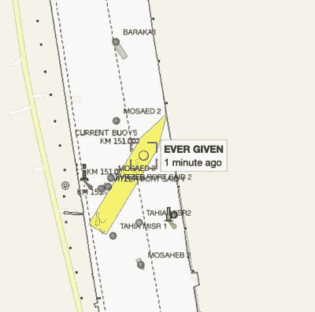

# 苏伊士运河的交通堵塞；集装箱船搁浅

> 原文：<https://hackaday.com/2021/03/23/traffic-jam-in-the-suez-canal-container-ship-run-aground/>

当地时间周二早上，一艘 220，000 吨的集装箱船“长赐号号”横在埃及海峡，埃及一条重要的航道被封锁。苏伊士运河，长期以来一直是一个贸易和战略要地，由于当局疯狂努力解救船只，双向交通都被阻断。

Live tracking shows a flurry of activity around the stricken vessel. If you find yourself transiting the Suez Canal next week, don’t do this. Everyone’s patience is going to be pretty thin.

长赐号号正把货物从中国运往鹿特丹，通过运河向北航行。停飞的确切原因仍不清楚，尽管此类事件通常是由于机械故障或狭窄航道内的导航错误造成的。像许多重要的水道一样，苏伊士运河需要过境船只配备引航员。这是为了确保通过运河的船只上有人有在 673 英尺宽的航道上航行的经验。然而，事故还是会发生，就像巨大的集装箱船一样，几乎没有出错的余地。

派往该地区的拖船船队已经开始努力营救船只，与运河岸边的挖掘机协同工作。[这张由[Julianne Cona]【T1]在事故现场拍摄的照片显示了问题的严重程度——挖掘机在船头挖掘巨轮阴影下的一个小点。](https://www.instagram.com/fallenhearts17/)

我们确信荷兰的航运公司和居民都渴望一个快速的解决方案，无论是为了避免昂贵的延误，还是仅仅为了更快地在网上购物。如果你住在运河附近，想要随时关注发生的事情，你可以随时抓住一个软件定义的无线电，实时跟踪事情。或者，[在船舶探测器上观察进度。](https://www.vesselfinder.com/?imo=9811000)如果你对航行苏伊士运河的正确程序有强烈的意见，请在评论中发表吧！