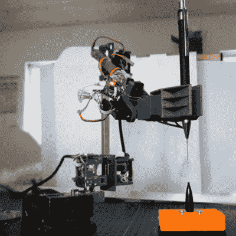

# 投入时间

> 原文：<https://hackaday.com/2021/03/27/putting-your-time-in/>

本周，我被一个黑客彻底震惊了——[Adam bck strm]的[令人惊叹的机器人手臂，它由经过修改的业余伺服系统](https://hackaday.com/2021/03/19/robot-arm-achieves-amazing-accuracy-with-just-servos/)制成。基本上，他已经拆开并重新组装了一些负担得起的现成伺服电机，就像这个 600 万美元的人一样，他将它们重新组装得更好、更强、更快。好的，更平稳。我们有技术。

 不可否认，结果非常棒，通过采用一些重型控制理论和冗余传感器来克服齿轮系反冲，这是廉价伺服系统的魔鬼，有经验的黑客可以用葡萄汁预算获得香槟机器人运动控制。但这不是凭空出现的。在他的文章中，[亚当]以“你可以说这个项目开始于 15 年前我在中学订购了 6 台无止境的伺服系统。”它显示了。

去看看他在 2009 年制作的六轴机器人的第一个版本的视频。).他在电机中内置了模拟位置传感器，这让他可以控制速度，并使它比你见过的任何其他业余伺服臂都更好地工作，但齿轮中仍有可见的齿隙。仅仅 12 年后，他在输出端安装了磁性编码器，一个快速的内环补偿了反冲。结果是当前的手臂移动得更快更平滑，同时保持准确性。

十二年。我想[亚当]也有一些其他的项目，但无论如何那都是一个长期的项目。我很高兴看到他的工作，不仅仅是因为它应该帮助许多准备加强他们的桌面伺服臂项目的其他人。但真正的教训是，如果你有一个正在解决的难题，你不必在这个周末完成。你也不用在下周末完成。只要你需要就继续敲，但是继续敲。当你完成后，对于漫长、缓慢的酝酿时间来说，结果会更好。你做过的时间最长的项目是什么？

This article is part of the Hackaday.com newsletter, delivered every seven days for each of the last 200+ weeks. It also includes our favorite articles from the last seven days that you can see on [the web version of the newsletter](https://mailchi.mp/hackaday.com/hackaday-newsletter-649368). Want this type of article to hit your inbox every Friday morning? [You should sign up](http://eepurl.com/gTMxQf)!