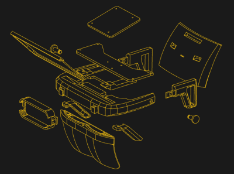

# Triton AR 耳机融合了库存和印刷部分

> 原文：<https://hackaday.com/2021/03/28/triton-ar-headset-blends-stock-and-printed-parts/>

增强现实(AR)和自然手势输入提供了未来人机界面可能会是什么样子的诱人一瞥，但在这一点上，该技术还没有在开源社区中被采用。尽管公平地说，到目前为止，大型商业玩家似乎并没有好到哪里去。你可以证明，除了在游戏早期普遍缺乏软件之外，最大的障碍是获得开放和负担得起的增强现实耳机。

这正是为什么[【格雷厄姆·阿特里】开发了海卫一](https://atlee19.github.io/TritonProject-Guide/)。这款 Creative Commons 许可的耳机结合了商用现成组件和 3D 打印部件，以黑客友好的价格提供了强大的 AR 体验。通过打印自己的零件并从全球速卖通订购组件，基本的 AR 功能应该花费 150 到 200 美元。如果你想添加手势支持，你需要在你的材料清单中添加一个 Leap Motion，但即使如此，这也是一个可靠的交易。

Exploded view of the Triton

这里的诀窍是，[格雷厄姆]使用的反射器来自一种出奇便宜的 AR 耳机，旨在与智能手机配合使用。通过将这些大规模生产的光学元件与 Triton 的 3D 打印结构中的 6 英寸 1440 x 2560 LCD 面板相结合，在用户的视野中投影高质量的图像比您想象的要简单得多。

如果你想把它用作手势界面的开发平台，你需要在前面专门设计的插座上安装一个 Leap Motion，否则，你需要做的就是插入一个 HDMI 视频源。这可能是从低功耗可穿戴设备到高端游戏电脑的任何东西，取决于你的目标。

[Graham]不仅提供了所有 3D 打印零件的 STL 和一份材料清单，而且他还做了一项出色的工作，用一步一步的指南记录了构建过程。这不是什么理论上的创造；你可以现在就订购零件，开始建造你自己的 Triton。如果你在寻找软件，他还出售一款基于 Windows 的“Triton AR Launcher ”,售价 4.99 美元，看起来非常漂亮，但绝对不需要使用硬件。

当然，很多人非常乐意坚持传统的键盘和显示器设置。很难说可穿戴显示器和手势界面是否真的会成为标准，它们最好留给科幻小说。但不管怎样，我们很高兴看到负担得起的开源平台来试验这种尖端技术。在未来的几十年里，它们中的任何一个成为标准的可能性微乎其微，我们讨厌被困在某个无法逃脱的围墙花园里，因为没有人开发出任何开放的替代方案。