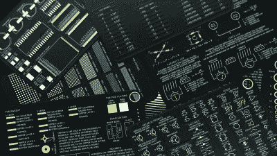

# 电子产品的袖珍备忘单

> 原文：<https://hackaday.com/2021/04/04/pocket-cheat-sheets-for-electronics/>

最初是为[Nerdonic]的工程客户制作名片，后来出人意料地发展成了一个独立的项目。一套 [CheatKard](https://nerdonic.com/products/cheatkard/electrical_engineering-basic) 由七张 PCB 直尺样式的电子备忘单组成。尺寸为 80 毫米 x 50 毫米，无论您所在国家的标准如何，它们都应该可以放在您的名片夹或钱包中。或者，可以用顶角上的一个小环将套件固定在一起。这些卡由玻璃纤维 PCB 原料制成，0.6 毫米厚，镀金和黑色哑光阻焊膜。层叠是这样的:

*   封面
*   衡量
*   示意图符号
*   组件值
*   封装，SMD 1
*   封装，SMD 2
*   PCB 设计
*   法律和理论

甚至在发货之前，[Nerdonic]已经被要求为其他领域制作一套 CheatKards，如摄影、化学、天线设计、数学等。虽然这些不像多年前的袖珍参考手册那样全面，但我们喜欢好的小抄。如果你想得到一套，看看[Nerdonic]的 [Kickstarter 项目](https://www.kickstarter.com/projects/nerdonic/cheatkard-electrical-engineering-reference-cards)，它在上线几个小时内就得到了资助，看看下面的短片。他还承诺每卖出一台电视机，就在亚马逊雨林种一棵树。

有没有喜欢的小抄或者小抄制作技巧？你喜欢你的小抄是实体的还是储存在你的电脑上？在下面分享你的评论。

 [https://www.youtube.com/embed/0ku6OJdDUwg?version=3&rel=1&showsearch=0&showinfo=1&iv_load_policy=1&fs=1&hl=en-US&autohide=2&wmode=transparent](https://www.youtube.com/embed/0ku6OJdDUwg?version=3&rel=1&showsearch=0&showinfo=1&iv_load_policy=1&fs=1&hl=en-US&autohide=2&wmode=transparent)

