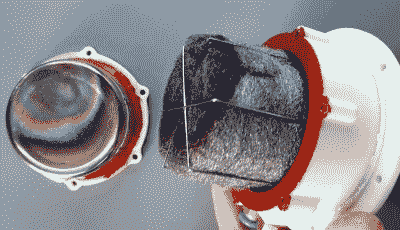

# 旋转水冷 3D 打印斯特林发动机

> 原文：<https://hackaday.com/2021/03/31/spinning-up-a-water-cooled-3d-printed-stirling-engine/>

斯特林外燃发动机从一开始就吸引了齿轮头，虽然这项技术从未广泛商业化，但有一个充满活力的补锅匠社区，他们建立和测试自己的想法。[Leo Fernekes]一直在研究一个由 3D 打印零件和普通硬件组件制成的小型斯特林发动机，在他最新的视频中，他带领观众完成了设计和测试过程。

我们以前见过 3D 打印零件的斯特林发动机，但在大多数情况下，它们只是结构部件。这一次，[Leo]真的想推动用塑料零件可以做的事情，所以从气缸冷侧的水套到菱形传动装置的齿轮和连杆的一切都已经打印出来了。除了轴承和杆，最值得注意的非印刷组件是不锈钢调味品瓶，被用作气缸。

The piston is made of constrained steel wool.

将热金属圆柱体与 3D 打印零件匹配自然会带来一些问题。[Leo]想出的解决方案是设计一个带齿的项圈来固定圆柱体，这样可以减少直接接触的表面积。然后他用一块空的 SMD 元件馈送带作为两个元件之间的绝缘体，并用高温硅胶覆盖整个接头。

像许多自制的斯特林发动机一样，这台发动机并不完美。它振动太大，一些内部组件在长期运行中有融化的趋势，总的来说，它需要一些微调。但它能运行，最终，这才是像这样的项目最重要的事情。随着时间的推移，改进将会到来，特别是一旦[Leo]完成了测功机的制作，他希望能够给他一些可靠的数据，说明他所做的改变是如何影响发动机的整体性能的。

如果你有一个玻璃试管，组装一个基本的斯特林发动机演示可能比你想象的要容易得多。如果你在寻找更实质性的东西，也可以使用商业套件，[，但即使是那些也可以从一些售后改装中受益](https://hackaday.com/2017/12/20/16-cylinder-stirling-engine-gets-a-tune-up/)。只需一点点努力，你马上就能让[号发电站为火星表面做好准备](https://hackaday.com/2019/08/28/kilopower-nasas-offworld-nuclear-reactor/)。

 [https://www.youtube.com/embed/eZUteOLEKz8?version=3&rel=1&showsearch=0&showinfo=1&iv_load_policy=1&fs=1&hl=en-US&autohide=2&wmode=transparent](https://www.youtube.com/embed/eZUteOLEKz8?version=3&rel=1&showsearch=0&showinfo=1&iv_load_policy=1&fs=1&hl=en-US&autohide=2&wmode=transparent)

【感谢 Baldpower 的提示。]