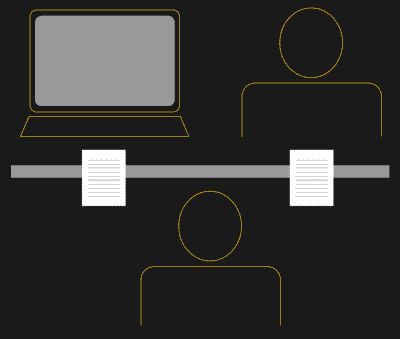
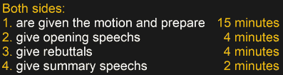

# 成功人工智能时代图灵测试的死亡

> 原文：<https://hackaday.com/2021/04/06/death-of-the-turing-test-in-an-age-of-successful-ais/>

IBM 已经开发了一个名为 Project Debater 的自动辩论系统，它研究一个主题，提出一个论点，听取人类的反驳，并制定自己的反驳。但是它通过图灵测试了吗？或者图灵测试还重要吗？

图灵测试于 1950 年首次推出，经常被引用为人工智能研究的第一年。它问，“机器会思考吗？”。今天，我们更感兴趣的是能够智能地推荐餐馆、驾驶我们的汽车沿着单调乏味的高速公路上下班，或者识别我们刚刚偶然发现的令人惊讶的花朵的机器。这些都符合人工智能的定义，即机器可以执行通常需要人类智能的任务。尽管你会在下面看到，图灵的测试甚至不是为了智力或思考，而是为了确定测试对象的性别。

## 《模仿游戏》

Turing test with machine

我们今天所知的图灵测试是为了看看一台机器是否能愚弄某人，让他以为自己是人类。它包括一个询问器和一台机器，机器对询问器是隐藏的。询问器仅使用键盘和屏幕向机器提问。询问者提问的目的是帮助他决定他是在和一台机器还是一个人说话。如果他不能分辨，那么机器就通过了图灵测试。

通常，测试是由许多询问者完成的，成功的衡量标准是不知道答案的询问者的百分比。在[的一个例子](https://hackaday.com/2014/06/09/ask-hackaday-program-passes-turing-test-but-is-it-intelligent/)中，为了给机器一个优势，测试是为了判断它是一台机器还是一个 13 岁的乌克兰男孩。年轻时代原谅了谈话中的许多奇怪之处。它骗过了 33%的审讯者。

Imitation game with a machine and a man

自然，图灵没有把他的测试称为“图灵测试”。相反，他称之为模仿游戏，因为目标是模仿人类。在图灵的论文中，他给出了测试的两个版本。第一个涉及三个人，审讯者，一男一女。男人和女人坐在与审讯者分开的房间里，在图灵的时代，理想的交流方式是通过电传打字机。目标是让询问者猜出谁是男性，谁是女性。男人的目标是欺骗审讯者做出错误的决定，而女人的目标是帮助他做出正确的决定。

图灵论文中的第二个测试用一台机器代替了那个女人，但是这台机器现在是欺骗者，而那个男人试图帮助询问者做出正确的决定。审问者仍然试图猜测谁是男性，谁是女性。

但是不要让这个目标欺骗了你。这个游戏的真正目的是替代他的问题“机器能思考吗？”。如果游戏成功了，那么图灵认为他的问题会得到解答。今天，我们对“思考”和“智能”的构成都更加成熟，我们也对机器显示智能行为感到满意，无论它是否是“思考”。为了解开这一切，让我们把 IBM 最近的 Project Debater 放在显微镜下。

## 伟大的辩手

IBM 的 Project Debater 是一个我们称之为复合人工智能而非狭义人工智能的例子。狭义人工智能的一个例子是将一幅图像呈现给神经网络，神经网络将标记该图像中的对象，这是一个狭义定义的任务。然而，复合人工智能执行更复杂的任务，需要许多步骤，更类似于人脑。

项目辩手首先被给予要辩论的动议。你可以[阅读 IBM 网页上的论文](https://www.research.ibm.com/artificial-intelligence/project-debater/index.html)了解其下一步行动的细节，但基本上它花了 15 分钟研究和制定一个 4 分钟的开场白来支持议案的一方。它还将语音转换为自然语言，并传递给观众。在最初的 15 分钟里，它还为反对的论点收集线索，并作出回应。这是为其后来的反驳做准备。然后，它听取对手的反驳，利用 IBM 自己的沃森语音转文本功能将其转换成文本[。它分析文本，并结合它以前制定的回应，提出自己的 4 分钟反驳。它会将其转换为语音，并以 2 分钟的总结发言结束。](https://www.ibm.com/cloud/watson-speech-to-text)

所有这些步骤，其中一些被认为是狭义的人工智能，加起来就是一个复合人工智能。整个过程是通过神经网络以及传统的数据挖掘、处理和分析来完成的。

以下视频是 Project Debater 和辩论比赛获胜次数世界纪录保持者 Harish Natarajan 之间的现场辩论。自己判断它的效果如何。

 [https://www.youtube.com/embed/m3u-1yttrVw?version=3&rel=1&showsearch=0&showinfo=1&iv_load_policy=1&fs=1&hl=en-US&autohide=2&wmode=transparent](https://www.youtube.com/embed/m3u-1yttrVw?version=3&rel=1&showsearch=0&showinfo=1&iv_load_policy=1&fs=1&hl=en-US&autohide=2&wmode=transparent)

Project Debater 通过图灵测试了吗？它没有进行正式测试，然而，你可以通过想象阅读 Project Debater 所说的文字来自己判断。你能说出这是机器生产的还是人生产的吗？如果你能把它误认为人类，那么它可能通过图灵测试。它还对人类辩手的论点做出回应，类似于图灵测试中的答题。

请记住，尽管 Project Debater 有 15 分钟的时间来准备开场发言，但没有给出其他发言花了多长时间的数字，所以如果回答时间是一个因素，那么它可能会在那里失败。但这有关系吗？

## 图灵测试重要吗？

今天的人工智能是否能通过图灵测试很重要吗？这通常不是目标。大多数人工智能最终都成为了市场上的产品，甚至那些一开始并不是这样的产品。毕竟，最终总有人要为研究买单。只要他们做好工作，那就没关系。

IBM Project Debater 的目标是提出有说服力的论点，做出不带个人偏见的明智决策，这是向企业和政府推销的有用工具。特斯拉的人工智能目标是驾驶车辆。有很多聊天机器人可以处理特定的电话和在线请求。它们都做一些通常需要人类智力才能完成的事情，并取得了不同程度的成功。重要的测试是他们是否做得足够好，让人们为他们付费。

也许询问一台机器是否能思考，或者它是否能冒充人类，并不真的相关。我们使用它们的方式只要求它们能够完成任务。有时这可能需要“类似人类”的行为，但大多数情况下并非如此。如果我们不使用人工智能来欺骗人们，图灵测试还有意义吗？