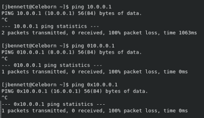

# 本周安全:无处不在的更新、PHP 后门和网络掩码

> 原文：<https://hackaday.com/2021/04/02/this-week-in-security-ubiquity-update-php-backdoor-and-netmask/>

早在一月份，我们报道了 Ubiquiti 违反了未披露的严重性的新闻。一位读者指出，一些设备的损坏可能与此有关。由于没有类似的报道，我当时没有想太多。然而，现在[一个来自 Ubiquiti 的告密者给了 Krebs 有趣的细节](https://krebsonsecurity.com/2021/03/whistleblower-ubiquiti-breach-catastrophic/)。

最初披露的“第三方云提供商”指的是亚马逊网络服务(AWS)。根据举报人的说法，几乎所有东西都可以访问，包括登录互联网上任何无处不在的设备的密钥，只要它支持云。攻击者在 Ubiquiti 的基础设施中安装了几个后门，并发出了 50 比特币的勒索威胁。值得称赞的是，Ubiquiti 无视勒索，收拾了烂摊子。

对于没有证据表明攻击者访问了用户帐户的说法，似乎有问题的数据库只是没有启用日志记录。没有证据，因为没有东西在看。到目前为止，我只看到了一份设备受损的报告，这可能是攻击的结果。如果您在 2020 年 12 月至 2021 年 1 月期间有一台 Ubiquiti 设备出现故障，请务必通知我们。

## 安全模式勒索软件

这是一个新的技巧——我们通常使用安全模式来修复计算机，但是一种恶意软件正在滥用它来破坏它们。这个想法似乎是你的杀毒软件可能没有在安全模式下运行，所以加密过程更有可能成功。另一方面，安全模式可能意味着您的服务器的共享文件夹是不可访问的，将破坏限制在一台计算机上。

实现这一点的奇特技巧是将有效载荷放在一个`RunOnce`注册表项中，并在该项的名称前加上一个星号。这个咒语向 Windows 发出信号，即使在安全模式下也应该运行。加密过程延迟了`explorer.exe`的启动，所以机器看起来会挂在空白的“安全模式”屏幕上。

## PHP Git 漏洞

一个[恶意提交](https://github.com/php/php-src/commit/c730aa26bd52829a49f2ad284b181b7e82a68d7d)在 27 日被潜入 PHP 的代码，大约五个小时后恢复。推送错误代码的开发人员帐户被认为受到了威胁，访问被撤销。几个小时后，不同的开发人员帐户恢复了还原操作。这一次，糟糕的代码出现了不到两个小时，然后被回复为幽默的提交消息 `Revert "Revert "Revert "[skip-ci] Fix typo"""`，一致认为托管 PHP 代码的服务器很可能以某种方式受到了威胁，于是[决定将 PHP 开发流程转移到 GitHub](https://news-web.php.net/php.internals/113838) 。

恶意代码非常简单。它检查`useragent`头中的神奇字符串，如果找到，就从那个头执行 PHP 代码。如果一个 PHP 版本实际上原封不动地附带了这段代码，那么损害将是惊人的，因为这将是每个使用 PHP 的 web 服务中一个易于使用的后门。值得指出的是，PHP 项目的开源特性导致了注入代码的快速发现，由于这种速度，这种攻击的实际损害可能基本为零。这似乎不是特别复杂的攻击，甚至没有伪装成无辜的代码。这只是一次试运行吗？

通过 [Phoronix](https://www.phoronix.com/scan.php?page=news_item&px=PHP-Git-Compromised)

## OpenSSL 缺陷

OpenSSL 刚刚在其 1.1.1k 版本中修复了一对严重的 bug[。第一个是 CVE-2021-3449，它允许恶意的重新协商请求使 OpenSSL 服务器崩溃。这是一个空指针解引用，众所周知很难转换成完整的 RCE，尽管并非不可能。](https://www.openssl.org/news/secadv/20210325.txt)

第二个 bug，CVE-2021-3450，没那么烦人，但可能更严重。如果 OpenSSL 被配置为验证证书，并且启用了某个严格模式标志，那么自签名证书可以被接受为签名证书。这是因为严格模式检查可能会覆盖可信 CA 检查的结果。

## 网络掩码灾难

IP 地址的书写方式有点奇怪。我们通常以“点分十进制”格式书写 IP。考虑以下三个 IP 地址:`10.0.0.1`、`010.0.0.1`和`0x10.0.0.1`。前两个相同，最后一个是无效地址，对吗？嗯，看情况。如果你坚持被认为是“标准的”点分十进制，那么是的。但是点分十进制的早期 BSD 实现也包括十六进制和八进制。这已经成为一种竞争标准，并不时出现。请看右边的图片，这是一个令人惊讶的例子。

那么，像 NPM 的`netmask`这样的库呢，它检查一个给定的 IP 地址是否是一个定义的网络的一部分？Netmask 的`.contains`函数将一个虚线字符串作为输入，并根据 IP 是否在给定的子网中返回 true 或 false。在 2.0.0 之前的版本中，它可以理解十进制记数法和十六进制记数法，但会忽略前导“0”。这意味着八进制表示将被理解为十进制。当应用程序的其他部分将 IP 视为八进制时，这是一个问题。网络掩码健全性检查认为 IP 是本地网络(10.0.0.1)的一部分，而实际上它属于 3 级通信(8.0.0.1)。安全前端将连接视为来自本地网络，而实际上它来自外部。

[这个小怪癖是由【维克多·维亚勒】发现的，并由一批研究人员](https://sick.codes/universal-netmask-npm-package-used-by-270000-projects-vulnerable-to-octal-input-data-server-side-request-forgery-remote-file-inclusion-local-file-inclusion-and-more-cve-2021-28918/)修复，他们的工作我们之前已经看过了。事实上，正是对`private-ip`包的早期修复导致了这一发现。该包认为`0127.0.0.1`是私有地址。没错…除非你的代码理解`0127.0.0.1`等同于`81.0.0.1`。让我们做一个小实验。尝试导航到或 ping 带有前导 0 的 IP 地址。你的浏览器或者终端把它理解成什么？令人惊讶的是，八进制格式被广泛接受。

现在有个难题。你怎么解决这个问题？记住，没有 RFC 明确定义 IPs 的点记法是如何工作的。我相信 NPM 上的一些软件包会忽略 IP 地址中的前导零，一些操作系统可能也会这样做。如果您更改`netmask`来理解八进制符号，那么这些应用程序现在正以您试图修复的方式易受攻击。不管怎样，总会有东西坏掉。

语义版本化对此有所帮助，尽管它不是银弹。NPM 使用 3 个数字系统，初始版本从 1.0.0 开始。对于向后兼容的错误修复，增加第三个数字。对于具有新功能但不破坏兼容性的更新，增加第二个数字。最后，对于破坏向后兼容性的主要更改，第一个数字会受到影响。`Netmask`不再向后兼容，因此修复发布为 2.0.0。许多应用程序都编写了灵活的依赖部分，允许在发布错误修复时自动更新，但不允许自动切换主要版本。它不会自动修复问题，但同样，这是不可能的。

## 勒索软件退款？

哔哔声电脑带来了一个勒索软件活动的故事，它正在做一些意想不到的事情——向受害者支付赎金。嗯，这是一种说法。目前还没有还比特币。声称恶意软件作者害怕执法行动，并计划在支付赎金后成为合法的研究人员。如果我有点怀疑，请原谅，但这听起来好得不像是真的。时间会证明这是第二次骗局，还是真正的变心。

## 研究员活动 Redux

还记得朝鲜 APT 用一个假的安全公司和恶意链接瞄准研究人员吗？谷歌跟踪这些事情的人，威胁行动者小组，已经警告说[这场运动以不同的名字](https://blog.google/threat-analysis-group/update-campaign-targeting-security-researchers/)回来了。“SecuriElite”是一家新的虚假公司，一群新的虚假研究人员活跃在 Twitter 和 LinkedIn 上。也就是说，他们一直很活跃，直到谷歌的标签拉响了警报。攻击者可能会隐藏一两周，然后在其他地方突然出现。