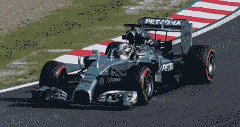
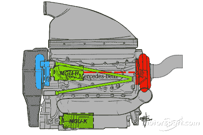
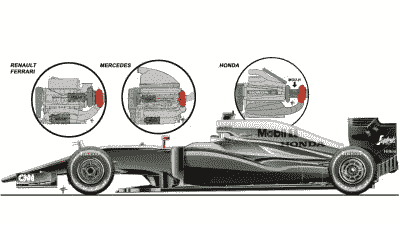
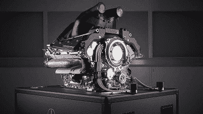

# 梅赛德斯 Split Turbo 改变了一级方程式赛车的游戏规则

> 原文：<https://hackaday.com/2021/04/06/mercedes-split-turbo-was-a-game-changer-in-formula-1/>

2014 年，一级方程式赛车放弃了 V8 发动机，而是选择要求所有车队使用 1.6 升排量的涡轮增压 V6 发动机，配备先进的能量回收系统。目的是让 f1 回归到与现代公路赛车技术相关的模糊概念，重点关注效率。这是通过强制规定比赛的最大油耗，以及强调混合动力技术来实现的。

The Mercedes W05 Hybrid was the first of 7 championship-winning F1 cars from the British-based, German-funded team. It quickly showed the value of the team’s split-turbo technology.

从那以后，梅赛德斯在现在被称为涡轮混合动力时代的领域占据了主导地位。从那以后，德国车队已经把每一个车手和车队的冠军都带回家了，经常在赛季结束之前就把冠军带回家。车队的引擎是这种优势的关键部分，被广泛认为比过去七年中的几场精选比赛更强大、更高效，这在很大程度上归功于公司创新的分流涡轮增压系统。今天，我们将探索为什么这项创新在一级方程式中如此改变游戏规则。

## 多种多样的收获

*本文假设具备涡轮增压器的基本工作知识。如果你还不太熟悉，请查看我们关于这个主题的初级读本。*

给团队的基本模板是生产 1.6 升强制进气发动机，可以选择使用涡轮增压器或增压器，所有团队都选择在他们的设计中使用涡轮。此外，团队能够使用能量回收系统来进一步提高性能和效率。MGU-K 代表电动发电机组-动能，连接到发动机的曲轴，在制动时收集能量，在加速时提供动力。MGU-H 或电动发电机单元-热，连接到涡轮增压器的轴，因此可以将废气中的废能转化为电能，或者相反，旋转涡轮增压器以减少涡轮迟滞。

The layout of the 2014 Mercedes F1 engine. Note the large separation of the compressor in blue and the turbine in red, connected by a long shaft through the centre of the engine’s vee. Image credit: [Giorgio Piola/Motorsport.com](https://us.motorsport.com/f1/photos/mercedes-w05-with-pu106-detail-/51957353/)

大多数制造商采用紧凑的设计，以相对传统的涡轮发动机为特色，尽管有一个 MGU-H 装置用于能量回收。然而，梅赛德斯决定采用非传统的分流涡轮设计。在常规的涡轮增压器中，压缩机叶轮和涡轮机叶轮由一根短轴连接，各自的壳体背靠背直接安装。然而，梅塞德斯意识到，将这两部分进一步分开会有很多好处。取而代之的是，压缩机安装在发动机的前部，涡轮安装在后部。这两个连接一个比通常长得多的轴，通过发动机的 v 形。这也使得 MGU-H 可以安装在 v 字形的中心，在压缩机和涡轮之间。

这个设计许诺了许多好处。将涡轮从压缩机中分离出来意味着废气中的热量不会过多地进入压缩机，从而降低了进气温度，并允许团队安装一个更小的中间冷却器。包装的好处还允许团队使整个发动机或动力装置更加紧凑，让底盘设计师更自由地对汽车进行空气动力学优化。它还允许更清洁，更直接的排气管路，这有助于功率输出，以及更短的进气管路，这有助于减少滞后，以提高驾驶性能。

Diagram showing the engine layouts of other competitors in the early turbo hybrid era. Image credit: [Giorgio Piola/Motorsport.com](https://us.motorsport.com/f1/photos/mclaren-mp4-30-side-view-with-possible-layout-of-honda-powerunit-inset-left-inset-ferrari-11452893/23133347/)

尽管有这么多好处，但它提出了一个问题，为什么这个解决方案如此新颖，原因是速度。F1 赛车的涡轮增压器转速超过 100，000 RPM。在如此高的角速度下，轴上最轻微的不平衡就能在几秒钟内摧毁一个涡轮。使该轴几乎长一个数量级只会使事情变得更糟，因为该长度产生的更大的力臂会显著加剧甚至最小的振动。然而，顶级赛车运动是在材料和加工方面尝试新技术的合适场所，梅赛德斯能够使该系统发挥作用。[该团队依靠他们在戴姆勒卡车部门涡轮增压方面的机构经验](https://www.espn.com.au/f1/story/_/id/14759128/mercedes-split-turbo-design-was-bloody-hard-get-right)，早在 2011 年就开始了发动机方面的工作，为 2014 年第一个赛季做准备。在涡轮混合动力时代的前三年取得统治性的表现后，[本田选择复制他们 2017 年引擎的想法。](https://au.motorsport.com/f1/news/honda-set-for-mercedes-style-split-turbine-compressor-864024/3010394/)最近，[雷诺车队与改变布局联系在一起，](https://the-race.com/formula-1/renault-evaluating-switch-to-mercedes-style-split-turbo/)据传法拉利也在考虑这个概念。

## 不是注定要走大路的

The engine in all its glory. Note the compressor visible at the front of the engine. Image credit: Mercedes

尽管一级方程式赛车重新关注可用于公路的技术，但你不太可能很快在你的高性能公路赛车中看到分离式涡轮增压发动机。在一级方程式中，递增的百分比增益可以成就或摧毁世界冠军的努力，空气动力学下压力的每一点都是在竞争中脱颖而出的必要条件。公路汽车根本没有任何真正的理由来关注这种紧密的包装，或从这种技术中获得的较低的进口温度。一般来说，安装一个更大的中冷器，将发动机罩加长一点会简单得多。此外，如此长的高速轴所需的严格加工公差将使得这种涡轮对于任何公路车辆来说都过于昂贵。他们也可能有完全不适合比赛环境之外的维护间隔。

虽然分流涡轮增压技术仍然局限于 F1 的赛道上，但它表明了跳出框框思考和忽视传统如何能够带来现实世界的工程效益。当它的竞争对手在追赶时，我们确信梅赛德斯 F1 的工程师们已经在拐角处寻找下一个绝妙的想法，这个想法最终将在赛道上值得一秒钟。