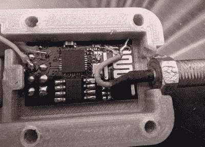

# 18650 带来了 ESP8266 无线中继器

> 原文：<https://hackaday.com/2021/04/08/18650-brings-esp8266-wifi-repeater-along-for-the-ride/>

我们真的很幸运有这么多令人难以置信的开源项目在互联网上流传，因为几乎总是有一些现有技术可以依靠。通过将不同项目中的点点滴滴结合起来，你通常可以为自己节省大量的时间和精力。这只是一个弄清楚所有部件如何组合在一起的问题，[就像[Beth iboothi]【T1]的这个聪明的混搭，它利用了流行的 TP4056 锂离子电池充电器模块恰好与 ESP-01 的尺寸几乎完全相同的事实。](https://www.reddit.com/r/functionalprint/comments/mk05wb/18650_esp8266_wifi_repeater_lasts_3_days/)

 通过采用旨在[将 TP4056 模块连接到 18650 电池](https://www.thingiverse.com/thing:2892321)末端的 3D 打印设计，并将其与 ESP8266 固件结合，[将强大的微控制器变成 WiFi 中继器](https://github.com/martin-ger/esp_wifi_repeater)，【bethiboothi】最终获得了一个便携式网络节点，据报道，充电可持续三天。即使有内置的 PCB 天线，观察到的范围也很好，但如果需要，外部黑客可以让你走得更远一点。

虽然[bethiboothi]目前似乎没有使用它，但`esp_wifi_repeater`固件确实有一个自动网格模式，看起来它非常适合这种设计。假设 ESP 的 CPU 能够满足需求，将一个临时的网状 WiFi 网络与一堆廉价的电池供电节点组装在一起将是在户外黑客营地获得网络连接的[绝佳方式。](https://hackaday.com/2020/08/24/running-a-successful-hacker-camp-in-a-pandemic-bornhack-2020/)