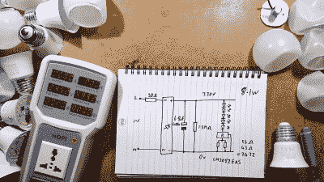
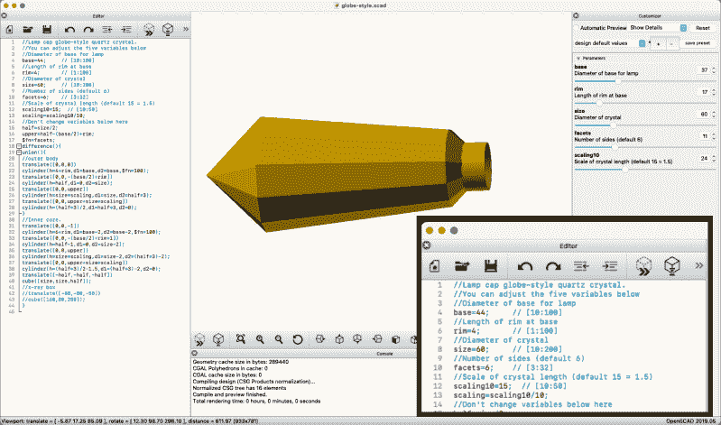

# 大克莱夫用 OpenSCAD 破解 LED 灯泡

> 原文：<https://hackaday.com/2021/04/08/big-clive-hacks-led-bulbs-with-openscad/>

在不小心压碎了一个廉价 LED 灯泡的塑料外壳后，[bigclivedotcom]发现他可以用 OpenSCAD 定制任何他想要的形状。他[上个月曾黑掉了一堆这种便宜的 LED 灯泡](https://www.youtube.com/watch?v=H09SI5qLmtY)，发现它们都有相似的电路拓扑。他试验的所有灯都驱动 led，这必然会缩短灯泡的寿命。通过对电流控制调节器进行逆向工程，可以很容易地通过改变一两个电阻来调整驱动电流。降低电流不仅可以延长灯泡的寿命，还可以将灯泡用于其他用途，比如装饰照明。

Tweaking the LED Current

提供了三个 OpenSCAD 脚本，生成他所谓的菱形、方尖碑和球形样式。用户可以调整每种风格的基本参数，如特征尺寸和刻面数量。他提到在他的脚本中缺少 OpenSCAD 定制器——这很容易添加，如下例所示([用户手册中关于定制器的章节](https://en.wikibooks.org/wiki/OpenSCAD_User_Manual/Customizer)解释了语法)。请注意，您不能让滑块生成实数，只能生成整数，这就是缩放因子被乘以 10 的原因。

Adding Parameter Customization Sliders is Easy

如果你能把底座密封好，这些别致的球形灯可以用作夜灯，也可以用作户外照明。有人想要定制吊灯吗？超大面板的指示灯？还有其他想法吗？如果你想进一步探索 LED 的寿命问题，根深蒂固的修补匠 Ted Yapo 写了一篇关于神秘的 10 万小时 LED 灯泡的深度文章。感谢[Cliff Claven]的提示。

 [https://www.youtube.com/embed/HZKu9QMN5xw?version=3&rel=1&showsearch=0&showinfo=1&iv_load_policy=1&fs=1&hl=en-US&autohide=2&wmode=transparent](https://www.youtube.com/embed/HZKu9QMN5xw?version=3&rel=1&showsearch=0&showinfo=1&iv_load_policy=1&fs=1&hl=en-US&autohide=2&wmode=transparent)

