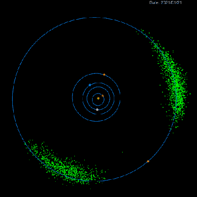

# 美国宇航局的露西在特洛伊迷航前伸展翅膀

> 原文：<https://hackaday.com/2021/04/10/nasas-lucy-stretches-its-wings-ahead-of-trojan-trek/>

使用太阳能探索太空的好消息是没有云层阻挡你的阳光。一些灰尘和碎片，是的，但远没有我们在行星上要处理的多。坏消息是，随着你在太阳系中漫游得越来越远，你的电池板捕捉到的太阳能越来越少。美国宇航局的露西飞船将依赖于每一平方英寸，所以我们很高兴听到[技术人员已经成功测试了它的太阳能电池板部署](https://www.nasa.gov/feature/goddard/2021/nasa-lucy-stretches-its-wings-in-successful-solar-panel-deployment-test)，为 2021 年 10 月的发射做准备。

Trojan asteroids (in green) orbit the Sun ahead of and behind Jupiter.

露西为期 12 年的任务是检查一颗主带小行星和七颗所谓的特洛伊小行星，特洛伊小行星是在木星轨道前方和后方拉格朗日点的两个集群中围绕太阳运行的小行星。所有这些访问所需的复杂轨道将使航天器比以往任何太阳能太空任务离太阳更远。为了弥补随后单位面积瓦特数的损失，设计者们尽了最大努力来增加面积。尽管这些面板折叠起来只有 4 英寸(10 厘米)厚，但它们打开后的直径却高达 24 英尺(7.3 米)；这足以提供距离其电源天文距离所需的大约 500 瓦。

近地小行星是令人兴奋的探索目标，部分原因是它们对我们的星球构成了威胁。特洛伊小行星，被认为是形成外行星的相同物质的原始残余，对我们没有这样的危险，但可能持有关于我们太阳系早期形成的见解。我们已经急切地期待着 OSIRIS-REx 样品的回归，而[隼鸟 2 号在经历了这么多第一次后继续它的使命。对这些遥远天体的一次长期考察将使我们在未来几年里继续观察。查看下面嵌入的视频，了解 Lucy 的任务概述。](https://hackaday.com/2018/10/16/the-science-of-landing-on-an-asteroid/)

 [https://www.youtube.com/embed/57aLfX3ZX2I?version=3&rel=1&showsearch=0&showinfo=1&iv_load_policy=1&fs=1&hl=en-US&autohide=2&wmode=transparent](https://www.youtube.com/embed/57aLfX3ZX2I?version=3&rel=1&showsearch=0&showinfo=1&iv_load_policy=1&fs=1&hl=en-US&autohide=2&wmode=transparent)

