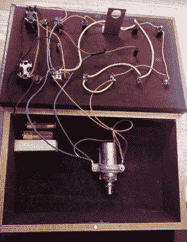

# 拨动开关拼图令人困惑，打开盒子

> 原文：<https://hackaday.com/2021/04/18/toggle-switch-puzzle-boggles-the-mind-opens-the-box/>

我们都有太多这种或那种成分的存货。也许你有太多的音频锅，你不知道该怎么用，或者可能是齐纳二极管。对[科技人]来说，那东西就是一堆拨动开关。幸运的是，他一直想用开关中的二进制代码建造一个锁箱——找到正确的代码，一个螺线管打开锁箱。这个可爱的零件箱特别版只对可能的 4000+组合中的两个组合  做出响应，所以任何试图打开它的人应该会封锁整个下午。

里面你会发现两个 9 伏电池，一个自制的金属锁，一个螺线管，以及四个 DPDT 和八个 SPDT 拨动开关的下侧。如果你只是拿起这个东西，不知道发生了什么，你会很困惑，不知道先做什么。盒子需要电力，所以你必须弄清楚哪个开关是哪个。但这要困难得多，因为左下角的开关在两条路径之间进行选择，导致一个未锁的书箱。

左边接下来的两个开关是代码 A 和代码 B 的开/关选择器，所以你不仅要选择正确的路径，还要给它上电。唯一的进度指示器是发光二极管——一个是主电源，另一个让你知道盒子没有上锁。对于~~咖啡桌~~缩放可视区域来说，这是多么有趣的话题啊！

想用你的一大堆开关做一些不太有用的事情吗？一台复杂无用的机器怎么样？