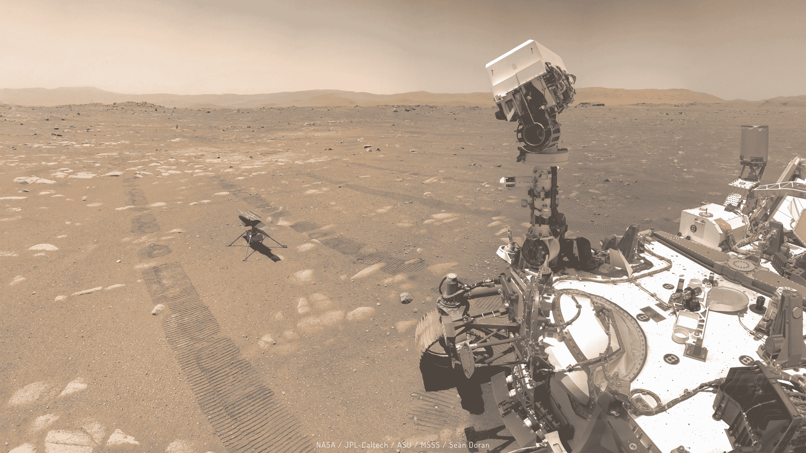
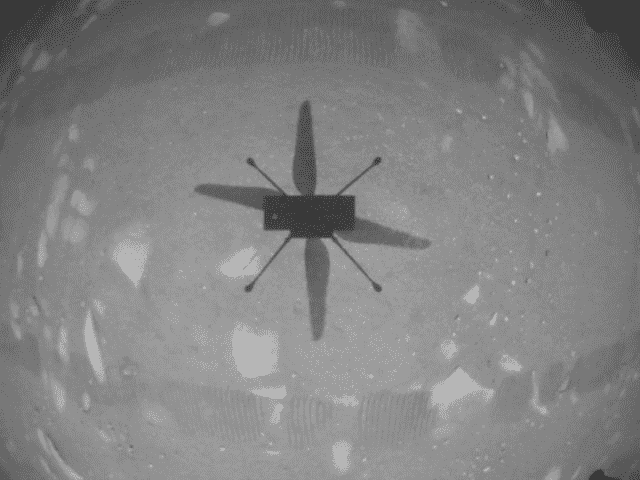
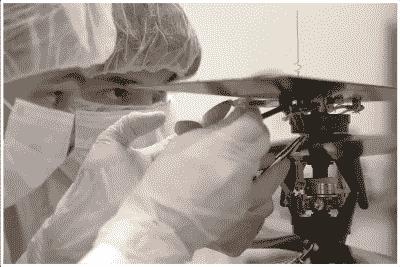

# 莱特兄弟:首次火星动力飞行成功

> 原文：<https://hackaday.com/2021/04/19/the-wright-stuff-first-powered-flight-on-mars-is-a-success/>

当你停下来思考飞行的历史时，令人惊讶的是莱特兄弟在北卡罗来纳海滩上的第一次成功飞行与尼尔·阿姆斯特朗在月球上迈出的第一步仅仅相隔了 66 年。我们能够很好地理解和应用空气动力学原理，从精致的木头和帆布结构发展到强大到足以从困住我们亿万年的重力井中逃脱的火箭，这是对人类创造力和探索动力的有力证明。

独创性再次赢得了飞行史上的胜利，这一次，跟随火星 2020 任务的同名直升机成功飞越了这颗红色星球。这次飞行仅持续了 40 秒，但证明了受控的动力飞行在火星上是可能的，火星是一个大气层像地球海平面以上 100，000 英尺(30 公里)处的空气一样稀薄的星球。这是一项历史性的成就，其背后的工程值得深入研究。

## 长期部署

 [https://www.youtube.com/embed/wMnOo2zcjXA?version=3&rel=1&showsearch=0&showinfo=1&iv_load_policy=1&fs=1&hl=en-US&autohide=2&wmode=transparent](https://www.youtube.com/embed/wMnOo2zcjXA?version=3&rel=1&showsearch=0&showinfo=1&iv_load_policy=1&fs=1&hl=en-US&autohide=2&wmode=transparent)

“创新”是所谓的“技术演示者”，本质上是一项辅助任务，与支持主要任务的主要科学有效载荷一起进行。在许多方面，技术演示者是事后想法，被迫适应奇怪的角落和缝隙，并尽可能少地影响主要的科学任务。尽管如此，别出心裁地获得了毅力号火星车提供的相当大一部分资源，以及一大块任务时间——30 个太阳或火星日——来完成它能完成的一切。

虽然看起来 30 sols 似乎有足够的时间来部署、测试和发挥创造力，但这实际上是一个非常紧张的时间表——毕竟，当你在火星上做这件事时，没有什么是容易的。考虑到这一点，美国宇航局在毅力号的时间表中加入了独创性操作，计划在开始探索 Jezero 陨石坑以寻找古代生命迹象的主要任务之前，摧毁独创性团队计划的一切。

毅力号要做的第一件事就是在火星表面部署独创性。我们已经看过部署测试的录像，这给人的印象是将直升机降落到水面上最多只需要几分钟。但同样，探索另一个星球并不容易，只有一次机会在另一个星球上进行首次飞行，创新团队没有冒险，让部署成为一个艰苦的过程，花了三个多星期才完成。

第一项工作是抛弃在宇宙航行和登陆火星的过程中包裹着独创性的碎片防护层。一旦相机确认盖子已经干净地脱落，飞机没有受到明显的损坏，坚忍号就开了相当长的一段距离到达指定的降落区。飞行团队显然对飞行区的地形非常挑剔，因为岩石可能会给直升机自主着陆带来问题。

一旦找到合适的区域，将装载的直升机部署到水面的漫长过程就开始了。“匠心”号被装在它的侧面，四个起落架中的两个折叠起来。飞机从锁中被释放出来，部分在重力的作用下，部分在一个小马达的帮助下，向下摆动到垂直位置。锁定在垂直位置后，两条折叠的腿被释放，由于减震机制将它们连接到飞机的船体上，它们向下弹到位。

最后，当团队确信一切检查完毕，空投区没有障碍物时，命令被发送到地面部署独创性。它下降了几英寸，于 4 月 6 日干净利落地降落在地表。对于飞行团队来说，这是一个重要的时刻——独创性现在靠自己了，摆脱了电力和数据连接的束缚，坚持不懈。这架微型飞机现在只能依靠其小型太阳能电池板产生并储存在电池中的能量生存，并且必须证明它可以在火星的严酷夜晚保持足够的温暖。

当创新团队正在进行这些检查时，漫游者移动了大约 4 米远，第一次将直升机的太阳能电池板暴露在阳光下。像任何游客一样，毅力号在前往指定的看守地点之前，在背景中与前乘客自拍，该地点位于离下车地点约 60 米的一个小斜坡上。

自部署以来，独创性一直忙于运行系统测试，以确保它准备飞行。包括解锁转子叶片和在 4 月 8 日进行低速旋转测试在内的测试结果非常有希望，美国宇航局宣布，首次飞行将在 4 月 11 日的某个时候进行，等待最后一项测试——全速转子旋转。虽然旋翼在 4 月 9 日确实设法全速旋转，但直升机上的飞行软件在试图从飞行前模式切换到飞行模式时触发了一个看门狗定时器。这导致了第一次飞行尝试的延迟，起初只延迟了几天。

但是随着新的首飞日期的到来和离去，有人宣布有必要重写飞行软件。当然，这需要广泛的测试，并随后将新软件上传到创新公司。在等待带宽完成这些任务的同时，飞行团队能够完成全速旋转测试，使他们能够将首次飞行尝试安排在 4 月 19 日凌晨。飞行计划非常简单——起飞，缓慢上升到 3 米的高度，在偏航前在原地悬停 30 秒，然后在起飞的同一位置降落。

## 第一次飞行

尽管独创性的首次飞行令人兴奋，但对它的报道有些虎头蛇尾，主要是因为飞行已经发生了，剩下的只是等待数据涌入。所以当团队盯着他们的屏幕时，有相当长的等待时间。但最终有足够的数据显示，独创性已经旋转起来，上升，盘旋，下降，着陆，再旋转下来，没有发生任何事故。

当高度计数据图出现时，事情变得更加令人兴奋，显示独创性已经在几秒钟内上升到表面上方三米多一点。但是第一批图像出现了。俯视导航相机拍摄的一张黑白照片显示了“独创性”投射在火星表面的影子，被“坚持不懈”的车轮轨迹清晰地框住。此后不久,“坚持”号上的摄像机传回了图像，清晰地显示了整个飞行过程。

既然证明在火星上可控飞行是可能的目标已经实现，独创性仍然有大量的实验要进行。“别出心裁”项目经理米米·昂(MiMi Aung)表示，在首次飞行后，将进行更长、更复杂的飞行。当然，这些飞行剖面有严格的限制——例如，独创性不会飞到坚忍号停泊的地方。但直升机将比第一次飞行飞得更高更远，测试飞机的极限。

JPL engineers attach a swatch of muslin from the 1903 Wright Flyer to Ingenuity. Source: NASA/JPL

虽然没有明确说明，但它肯定暗示了在某些时候，由于飞行操作团队超出了飞机的处理能力，独创性可能最终会崩溃。在某种程度上，这很合适——独创性总是在飞行历史的单程旅行中，并且发现在火星大气中运行的限制可能是第一架火星飞行器遇到的最好的结局。

尽管如此，如果“独创性”号以一次漂亮的着陆完成其最后一次飞行，准备被未来的探险者捡起来，并被放置在未来的火星航空航天博物馆，就像今天展示的莱特飞行器一样，这可能会很好。如果发生这种情况，这个循环将是完整的，因为藏在“独创性”号上，缠绕在太阳能电池板下的一根电缆上的是来自飞行器机翼的一小块薄纱样本。