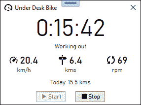

# 在你桌子的掩护下骑车离开

> 原文：<https://hackaday.com/2021/04/17/pedaling-away-under-the-cover-of-your-desk/>

像我们许多人一样，韦恩·维纳布尔斯发现自己在过去的几个月里比平时坐得更多。在配备了一辆支持蓝牙的桌下健身车后，他很快发现这款应用程序并不理想，于是[着手对他的自行车](https://codaris.github.io/UnderDeskBike/)的协议进行逆向工程。

Custom GUI for the exercise bike

第一步是使用他的 Android 手机上的一些应用程序来显示自行车上的配置文件，这些文件显示他的特定机器使用了北欧蓝牙 UART。这意味着唯一的工作就是解码来自无线串行端口的字节流。使用手机上的 Wireshark 和蓝牙日志，[Wayne]能够将各种命令与视频中的点对应起来。还有几个字节他无法识别，但[韦恩]有足够的时间快速处理。NET 应用程序，可以开始锻炼，并将其全部记录到数据库中。他的应用程序的代码在他的 GitHub 上。

虽然[Wayne]没有具体说出他在这个项目中使用的自行车的名称，但我们找到了他在给 Exerpeutic 900e 的文章中展示的图像。它似乎已经停产，但是逆向工程方法应该可以在一系列蓝牙连接的机器上使用。这不是我们在 Hackaday 看到的第一辆被逆向工程解放的自行车。我们感觉这不会是最后一次。