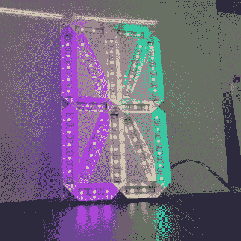
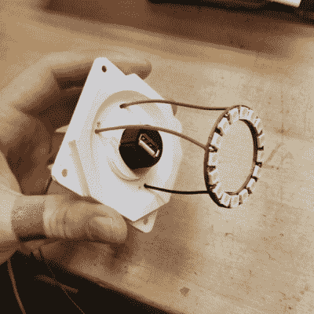
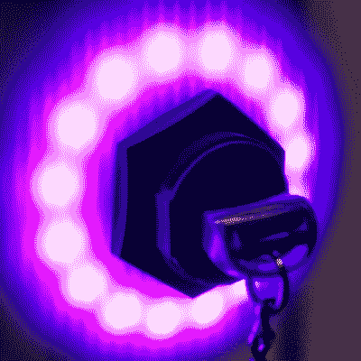

# 数码武器的肖像

> 原文：<https://hackaday.com/2021/04/15/portrait-of-a-digital-weapon/>

多年来，艺术家们一直在创造描绘大规模杀伤性武器、战争和人类冲突的艺术。但是在 21 世纪，战争的武器和战场正在发生变化。未来许多冲突的结果肯定将取决于数字战士，他们挤在电脑屏幕前，敲击键盘和操纵操纵杆，或者使用不正当的方法感染电脑，使其瘫痪或破坏基础设施。艺术家如何给一个看不见的虚拟数字武器赋予物理形态？这个问题激发了[Mac Pierce]创作他最新的数字武器的[肖像。](https://www.macpierce.com/portrait-of-a-digital-weapon)

[Mac]的艺术作品是对一种虚拟数字武器的物理描述，这是一种民族国家的网络攻击。当被激活时，这个片段显示了 Stuxnet 病毒的完整代码，这种蠕虫病毒在 2008 年左右使伊朗纳坦兹的核燃料生产设施部分瘫痪。

[Mac]花了一段时间来最终确定他的设计方案。他通过哨兵枢纽卫星图像服务获得了伊朗纳坦兹设施的高分辨率卫星图像。这是印在一个透明的乙烯和粘在一个半透明的聚碳酸酯片。在聚碳酸酯层后面，他使用 WS2812 可寻址 LED 条建造了一个大型的单个数字 16 段显示器，用于显示 Stuxnet 代码。离心机设施上方增加了一个防水 USB 插座，主综合体周围有一圈 WS2812 LEDs。当插入 u 盘时，Stuxnet 代码显示在 16 段显示屏上，一次显示一个字符。离心机大楼周围的 LED 环以随机间隔亮起，并以红色旋转，表示离心机出现故障。

16 段显示屏建在铝制基板上，用 3D 打印挡板固定 LED 灯条。为了容纳其余的电子设备，他建造了一个单独的 3D 打印框架，可以添加到主艺术框架中。由于这太大了，无法在 3D 打印机上打印成一片，所以它被分成几部分，然后使用嵌入的金属螺栓加固将这些部分连接在一起。这是制作大型刚性零件的一个很好的技巧。

一个阿达果羽毛 M0 微控制器板，微型 SD 卡插槽是该项目的大脑。为了从羽毛的 3.3 V GPIO 输出获得 5 V 逻辑数据信号，[Mac]在将数据发送到 LED 条之前，使用了两个额外的 WS2812 LEDs 作为电平转换器。驱动所有的 led 需要近 20 W，所以他使用 USB-C 供电，增加了一个电力传输协商板来获得所需的电力。

Arduino 代码很简单。它读取存储在 SD 卡上的字符，并将其顺序发送到 16 段显示器。USB 隔板周围的圆环也会亮起白色，但它会随机变为红色，以模拟离心机的加速。检测 u 盘何时插入是[Mac]发现的另一个好方法。当插入 USB 棒时，外壳(屏蔽)和 GND 端子之间的连续性用于触发 GPIO 输入。

网络战将会持续下去。我们已经看到，世界各地国家和非国家行为者对关键基础设施的袭击越来越多。Stuxnet 是这一不断增长的恶意武器化代码类别中的第一个。使用这样的物理表示来承认它的存在可以提醒人们，几行软件可以像任何其他物理武器一样造成严重破坏。休息之后，请观看简短的项目视频。

[https://player.vimeo.com/video/526813175](https://player.vimeo.com/video/526813175)