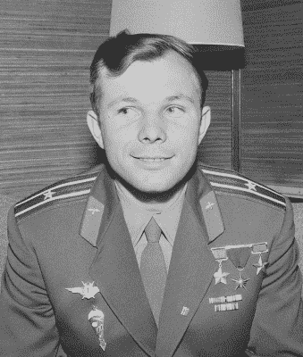

# 六十年前的今天:尤里·加加林成为第一个进入太空的人

> 原文 60 年前的今天，尤里·加加林成为第一个进入太空的人

当我们这些对太空探索感兴趣的人兴奋地期待着新的月球和火星探索时，我们有必要回顾一下，因为今天是一个特殊的纪念日。六十年前的 1961 年 4 月 12 日，搭载着飞行员尤里·加加林的“东方 1 号”宇宙飞船从位于现在哈萨克斯坦的拜科努尔航天发射场发射升空。在 108 分钟的任务中，他成功完成了绕地球一周的飞行，然后在重返大气层并降落在莫斯科南部萨拉托夫州恩格斯附近的一个农场后从飞船上跳伞。

Yuri Gagarin

通过这样做，他成为第一个进入太空的人和第一个绕地球飞行的人，他成为苏联和俄罗斯人民以及世界其他地方的英雄，并通过击败美国人赢得奖金而为苏联太空计划取得了重大胜利。从那时起，所有去过太空的宇航员都站在第一批独自离开大气层的先驱飞行员的肩膀上，但加加林的名字在他们中间是最高的。

在俄罗斯，人们正以特别的热情庆祝这个周年纪念日，特别的活动，电视报道，普京总统对着陆点的访问，以及国际空间站上的俄罗斯宇航员从太空[进行的访问](https://www.ruptly.tv/en/videos/20210411-018-ISS--Cosmonauts-honour-60th-anniversary-of-Yuri-Gagarin-s-historic-flight)。与此同时，离家更近的太空机构仍然守口如瓶，[美国国家航空航天局没有提及国际空间站远征 65 号机组人员的特定目标](https://www.nasa.gov/press-release/nasa-astronaut-mark-vande-hei-crewmates-arrive-safely-at-space-station)。

我们认为不应该让冷战的政治影响我们对加加林以及将他送上轨道的工程师和科学家的成就的看法，因此在处理太空历史时，我们更愿意讲述整个故事。如果你想读更多关于东方号的历史，我们会给你介绍另一位苏联宇航员的故事，[瓦伦蒂娜·捷列什科娃，第一位进入太空的女性](https://hackaday.com/2018/06/12/the-flight-of-the-seagull-valentina-tereshkova-cosmonaut/)。

Header image: Нина ПЕТРИЩЕВА, [CC BY-SA 4.0](https://commons.wikimedia.org/wiki/File:Gagarin_byust.jpg) .