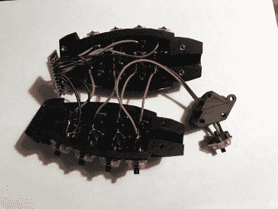

# 这个菠萝键盘是炸弹

> 原文：<https://hackaday.com/2021/04/18/this-pineapple-keyboard-is-the-bomb/>

为什么我们没有想到这一点？在制作 dactyl manuform(一种半人体工学分离键盘)时，[dapperrogue]有了改变人生的顿悟，键盘可以是任何形状或大小，只要内部有布线和微控制器的空间。[dapperrogue]第一次涉足虚构的军械世界是以 F-bomb 的形式——一个圆形的宏 keeb，以经典的圆形爆炸形状制成，上面覆盖着功能键。在此爆炸性反馈的基础上，[dapperrogue] [建造了这个菠萝炸弹 keeb](https://imgur.com/a/isTBBxA) ，  唯一的杀伤因素是按键开关的咔嗒声。

这款手雷总共有 25 个钥匙，其中 24 个在身体周围的 4×6 网格中。第 25 把钥匙，最好的一把，藏在控制杆下面，你可以打赌只有先拉下插销才能启动它。我们喜欢使用杠杆，因为它让我们想到莫尔斯电码键盘，这可能是我们使用开关的原因。

里面是一个 Arduino Pro 微运行 QMK 和一些巧妙的布线。完全 3D 打印的外壳分为两个主要部分，用 M3 螺丝连接，加上顶部。如果你想自己打包一个，[STLs 和固件在 GitHub](https://github.com/dbostian/pineapple) 上。只是不要把它带到机场。

请务必在休息后查看演示——在股票固件中，每个键都会发出不同的拟声词 boom 类型的声音。当谈到宏焊盘设计时，你更像一个和平主义者吗？这可以理解。我们有很多不同的造型值得欣赏。

 [https://www.youtube.com/embed/i0XybL9lTCo?version=3&rel=1&showsearch=0&showinfo=1&iv_load_policy=1&fs=1&hl=en-US&autohide=2&wmode=transparent](https://www.youtube.com/embed/i0XybL9lTCo?version=3&rel=1&showsearch=0&showinfo=1&iv_load_policy=1&fs=1&hl=en-US&autohide=2&wmode=transparent)

 [https://www.youtube.com/embed/bZw8GzZ7DbM?version=3&rel=1&showsearch=0&showinfo=1&iv_load_policy=1&fs=1&hl=en-US&autohide=2&wmode=transparent](https://www.youtube.com/embed/bZw8GzZ7DbM?version=3&rel=1&showsearch=0&showinfo=1&iv_load_policy=1&fs=1&hl=en-US&autohide=2&wmode=transparent)

通过 [r/mk](https://www.reddit.com/r/MechanicalKeyboards/comments/mph41a/i_designed_another_novelty_keyboard_meet_the/)