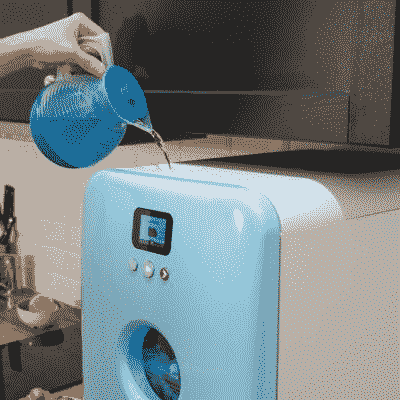

# 洗涤剂 DRM 在小型洗碗机上被击败

> 原文：<https://hackaday.com/2021/04/16/detergent-drm-defeated-on-diminutive-dishwasher/>

事情真的发展到这一步了吗？我们真的已经到了洗碗机拥有专有洗涤剂盒，而你却被迫以高价购买的地步了吗？

 显然如此，至少对某些种类的常见厨房用具来说是如此。这个有问题的特殊单元有一个友好的名字 Bob，是一个紧凑的台面单元，针对非常小的厨房市场。[dekuNukem]最近拿起了其中的一个单元，震惊地得知新的洗涤剂盒将花费一只胳膊和一条腿。所以很自然的，[他黑掉了](https://github.com/dekuNukem/bob_cassette_rewinder)的洗衣粉盒子。一个带有边缘连接器和 256 字节 EEPROM 的小型 PCB 从每个 Bob 墨盒中产生；一点逆向工程揭示了正确的旋转位，以重置墨盒到其完整的 30 次洗涤计数，导致一个加密狗连接到墨盒时，它的复位和填充时间。

随着电子设备的出现，[dekuNukem]开始研究清洁剂的补充。这似乎是更困难的部分，虽然它是由一些相当详细的规格墨盒内容的帮助。稍微计算一下就能发现需要达到的正确浓度，OEM 墨盒中的成分很容易——也很便宜——从商业洗碗精中获得。可以使用注射器用适当稀释的溶液重新填充药筒；结果是，每次清洗的成本只有使用 OEM 墨盒的 1/75。

尽管我们鄙视“赠送打印机，收取墨水费用”的模式，但鲍勃的计划似乎更糟糕。我们已经看到这种技术被用来将人们锁定在任何东西上，从[冰箱水过滤器](https://hackaday.com/2020/06/14/the-water-filter-that-wouldnt-defeating-drm-with-duct-tape-and-a-dremel/)到[猫砂](https://hackaday.com/2018/09/04/doing-logic-analysis-to-get-around-the-catgenies-drm/)，所以我们真的很喜欢【dekuNukem】在这里解决所有问题的方式，他认为分享他的解决方案是合适的。