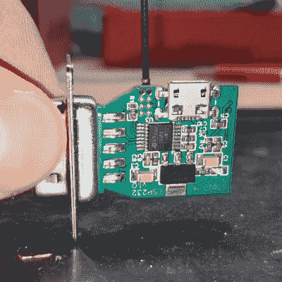

# DIY 无线串行适配器语音(真)RS-232

> 原文：<https://hackaday.com/2021/04/18/diy-wireless-serial-adapter-speaks-true-rs-232/>

有一个陷阱潜伏在等待黑客，他们看着一件设备，看到一个标有“串行/ RS-232”的端口，并开始得到想法。问题是，设备越旧，它就越有可能对如何使用 RS-232 有点过时。老式电子设备可能希望串行数据处于双极性电压电平，该电平高于典型微控制器用来传输的电平，这就是一些老式台式设备[g3gg0]面临的情况。[g3gg0]没有处理电缆和有线适配器，而是决定设计一个无线适配器，一端是 WiFi 和蓝牙，另一端是真正的 RS-232。

 该适配器采用 ESP32，并连接到 DB-9 插头上，因此它很漂亮，也很小。它使用 [ST3232](https://www.st.com/en/interfaces-and-transceivers/st3232c.html) 芯片在微控制器端以 3 V 逻辑电平进行通信，在老式硬件端支持高达+/-13 V 的双极性逻辑，并且一个基本的 web 界面允许设置波特率等硬件参数。ST3232 收发器的优点在于，它不仅体积小，而且可以采用 3 V 电源供电，内部电荷泵只需 4 个 0.1 uF 电容。

至于实际使用适配器，[g3gg0]说适配器的串行端口暴露在端口 23 (Telnet)上的 TCP 上，这是一些程序和硬件所支持的。或者，您可以通过 USB 将 ESP32 连接到自己的计算机，并运行固件，将任何串行数据直接连接到另一端的适配器。

包括原理图、物料清单和 PCB 设计的设计文件[在线共享](https://oshwlab.com/EFS-GH/esp32-rs232)，您可以在下面嵌入的视频中看到适配器的简要介绍。

 [https://www.youtube.com/embed/Nh6mOJvJk3s?version=3&rel=1&showsearch=0&showinfo=1&iv_load_policy=1&fs=1&hl=en-US&autohide=2&wmode=transparent](https://www.youtube.com/embed/Nh6mOJvJk3s?version=3&rel=1&showsearch=0&showinfo=1&iv_load_policy=1&fs=1&hl=en-US&autohide=2&wmode=transparent)

串行接口上的 RS-232 已经存在很长时间了，所以我们肯定没有看到像这样的项目的结束。[g3gg0]的电路板肯定会使这个旧的 LED 招牌更容易识别。