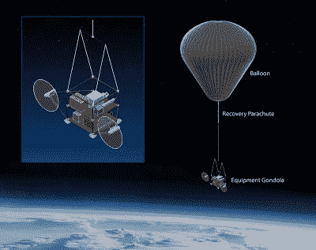
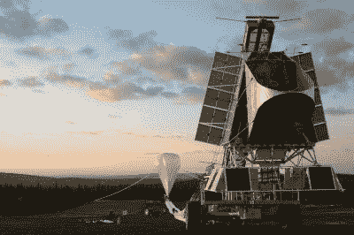

# 遮挡阳光:可行的气候对策还是绝对的疯狂？

> 原文：<https://hackaday.com/2021/04/26/blocking-out-the-sun-viable-climate-countermeasure-or-absolute-madness/>

如果说有什么是人类讨厌的，那就是锻炼意志力。无论是戒掉不健康的食物，早睡，还是使用更少的能源和减少温室气体排放，我们都很不擅长。相反，如果有一件事是人类喜欢的，那就是变通方法。让我们像无忧无虑的享乐主义者一样生活，并处理棘手的后果，这样我们就不必这样做。

尽管如此，气候变化问题的一个解决方法是很棒的——遮挡太阳光线以冷却我们正在变暖的地球。

## 它是如何工作的？

Stratospheric aerosol injection aims to reduce global temperatures by reflecting sunlight back out into space before it warms the Earth. Other geoengineering techniques aim to help cool the Earth, too. Marine cloud brightening aims to also reflect more sunlight, but from a lower level of the atmosphere, while cloud thinning aims to reduce the heat trapped on Earth by Cirrus clouds.

基本理论很简单。通过将气溶胶——悬浮在气体中的微小颗粒——注入平流层，我们可以将更多的阳光反射回太空，而不是让阳光温暖地球。这一想法是为了减少来自太阳的热量，以弥补大气中较高的温室气体含量带来的额外热量。这个概念很好理解，并且在过去已经得到了证明。像大规模火山爆发这样的事件已经将大量的颗粒物质释放到大气中，结果产生了明显的冷却效应。

当然，如果你看到了詹姆斯·邦德的恶棍或声名狼藉的伯恩斯先生，重要的是要注意，我们的目的并不是完全遮住太阳。持续的黑夜将会带来全面的负面影响，导致农作物歉收和哥特亚文化的复兴。相反，这个想法是在大气中添加少量的微粒或气溶胶，以增加平均百分之几的阳光反射量。该量可以变化，以将全球温度保持在期望的范围内。

## 为什么我们还没开始呢？

虽然基本理论很简单，但细节却很棘手。气候系统是一个复杂的系统，有许多相互作用的运动部分。一个领域的微小变化可能会对另一个领域产生意想不到或不到的影响。例如，该技术的反对者担心平流层化学或温度的这种变化会对降雨模式产生巨大影响。这可能导致天气的剧烈变化，或者导致重要农业地区的干旱，从而导致严重的食物短缺。

还有工程问题需要解决。在一个小的大气区域制造反射性气溶胶进行测试是一回事；在对全球气温产生真实影响的范围内这样做完全是另一回事。要做到这一点，需要仔细考虑采购材料和将材料运送到高层大气的排放成本。物流问题也是一个非常现实的问题。它可能会证明，在平流层中制造足够的气溶胶来冷却地球，而不同时花费大量的能量将它们带到那里，是完全不切实际的。

## 平流层实验

The balloon platform makes for a simple and cost-effective science platform. The SCoPEx team believes that a full-scale stratospheric cooling project would likely use conventional fixed-wing aircraft, however.

为了调查这些问题并了解更多关于这一过程的信息，哈佛大学的平流层受控扰动实验(SCoPEx)正在研究这项技术。该实验计划将一个气球放飞到高层大气中，并在有限的区域内散布微粒以研究其影响。实验将涉及亚微米碳酸钙颗粒的测试，选择亚微米碳酸钙颗粒是因为它们接近理想的光学特性和预期的臭氧安全属性。随后的研究可能会探索其他物质，如已经存在于平流层中的硫酸盐，尽管由于它们在臭氧消耗中的作用以及它们可以从太阳吸收的热量而被认为不是最理想的。

然而，该项目在最近几个月遇到了重大挫折。在与瑞典航天公司合作建造测试飞行器后，原定于 6 月进行的飞行器系统测试发射被取消。当地环保团体和其他人反对该项目，理由是它会破坏地球气候，应该不惜一切代价避免如此大规模的地球工程。

The SCoPEx test balloon was due to launch in June to shake down the vehicle’s control systems. Public opposition has stalled the project for the time being.

虽然最初的发射仅仅是为了测试气球平台，不会向大气层运送任何测试材料，但面对公众的异议，这项任务被取消了。SCoPEx 项目已选择在此期间进行进一步的公众咨询，希望以此缓解担忧，将任何潜在的发射推迟到最早 2022 年。

这一事件暗示了围绕地球工程这一主题的争议。大体上，观点分为两大阵营。有些人认为，我们应该只关注减少排放，任何替代技术都是一种干扰，无助于解决根本问题。其他人认为，世界在减排方面的缓慢进展意味着迫切需要其他解决方案，以避免气候变化可能带来的最坏结果。不管公众的意见如何，对这项技术的研究已经开始加速；美国政府最近资助国家海洋和大气协会(NOAA)400 万美元来研究这个概念。

这场辩论可能会持续一段时间，但随着资金继续流入该领域，我们可能还没有听到这些计划的最后一次减弱阳光。这可能被证明是不切实际的，甚至对我们的全球气候造成极大的破坏。但是，除非我们进行科学研究，否则我们永远也不会知道。当我们这样做的时候，期待在这里读到它！