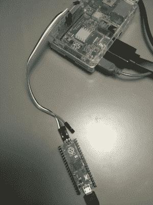
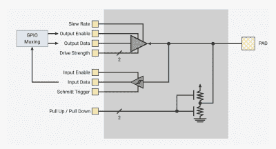
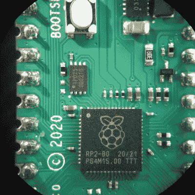

# raspberry Pi RP 2040:STM 32 视角下的实践体验

> 原文：<https://hackaday.com/2021/05/19/raspberry-pi-rp2040-hands-on-experiences-from-an-stm32-perspective/>

在过去的几个月里，Raspberry Pi Foundation 发布的配有 RP2040 微控制器的 Raspberry Pi Pico 板在创客社区掀起了巨大的波澜。许多人已经演示了如何利用两个可编程 I/O (PIO)状态机外设来创建 DVI 视频发生器和其它数字外设。

除了这种兴奋之外，它还提出了一个问题，即这是否会给我们使用 STM32、SAM 和其他基于 Cortex-M 的 MCU 的人带来任何重大变化。RP2040 可能是我们某些项目的有效选择吗？由于 RP2040 是一款双 Cortex-M0+处理器 MCU，因此将它与当前 32 位 ARM MCU 领域的重量级产品之一 ST Microelectronics 的产品相提并论似乎是公平的。

Raspberry Pi 基金会的小人物成功地向 ST 的工程师展示了它是如何做到的吗，或者前者应该重新审视他们的一些假设吗？将底层代码从 STM32 移植到 RP2040 有多难？

## 会有多难呢？

Raspberry Pi Pico RP2040-based board, hooked up to a Raspberry Pi SBC acting as SWD dongle.

长话短说，在 RP2040 引起我的注意后，我认为尝试将我的[基于 C++的 STM32 框架](https://github.com/MayaPosch/Nodate)移植到这个新的 MCU 可能会很有趣。不过，对于双 Cortex-M0+内核来说就没那么多了，因为我有 STM32H7 双核(M4&M7)MCU，它可以轻松击败 RP2040，并有更多的 I/O 可用。最让我感兴趣的是 RP2040 中的这个状态机外设(PIO ),它似乎值得仔细看看。

根据我使用 STM32 的经验，我认为我可以快速移植一些文件，在项目中创建一个新的“RP”架构分支，然后开始比赛。Cortex-M 就是 Cortex-M 吧？使用基于 ARM 的新型 MCU 的通常程序是获取数据手册、参考手册和 CMSIS 器件文件。此后，人们可以很容易地修改低级代码，以使用新的外设命名和寄存器布局，而核心级器件(SysTick，NVIC 等。)保持原样。

也许很天真，我甚至在检查 CMSIS 支持或浏览参考手册之前就订购了一个 Raspberry Pi Pico 板。令我惊讶的是，我发现 CMSIS 支持甚至与 Cortex-M 生态系统其余部分的互操作性还没有出现在雷达上。不过，RP2040 MCU 的 SVD 文件在“Pico SDK”中提供，可用于[从其生成设备标题](https://arm-software.github.io/CMSIS_5/SVD/html/svd_SVDConv_pg.html)。多亏了克里斯·霍库巴在用 RP2040 引导 CMSIS 上的努力，我最终有了一个可行的解决方案。

## 这可能更容易

RP2040 boot sequence (RP2040 datasheet, Fig. 15).

对于 STM32 项目，让裸机项目在目标 MCU 上工作需要一些项目。这些包括执行一些基本环境设置的启动代码，以及中断处理程序的向量表。还有[链接器脚本](https://hackaday.com/2020/12/23/bare-metal-stm32-exploring-memory-mapped-i-o-and-linker-scripts/)来确保所有位都在正确的内存偏移量结束。这非常简单，MCU 在启动时从默认地址的 Flash ROM 加载固件映像。

RP2040 的第一个障碍是理解它的链式引导装载程序过程。与过去的可引导软盘或 PC 中的 HDD/SSD 非常相似，外部 QSPI 闪存 ROM 基本上被 MCU 视为潜在的引导设备。第一级引导加载程序集成在 MCU 的引导 ROM 中，地址为 0x0000 0000，它在引导时检查 QSPI 接口，尝试从中加载 256 个字节。这将被检查是否有有效的 CRC32 散列匹配，如果匹配，则被假定为第二阶段引导加载程序。

这个第二阶段引导程序可以做很多事情，其中一些是必需的。现在可以说的是，与一些著名的 STM32 克隆产品相比，如 giga devices*I-不能相信它不是正版的 STM 32*克隆产品，它们也使用 SPI ROMs，RP2040 的整个过程并不直观，没有很好的记录或透明，有很多绊脚石。

## 好的艺术家临摹

我花了不少时间研究 RP2040 数据手册[并四处询问，才弄清楚 STM32 中的外设时钟管理器如何映射到 RP2040 系统架构。事实证明，RP2040 的版本被称为 RESETS，其工作原理基本上是相反的:您必须取消块上的 reset 条件才能为它启用时钟。要使能 GPIO 时钟，必须切换 RESETS_RESET (PADS_BANK0)的位 8。](https://datasheets.raspberrypi.org/rp2040/rp2040-datasheet.pdf)

Block diagram of an RP2040 GPIO pad.

明白了这一点，我查看了文档中的 GPIO 外设部分(第 2.19 节)。有一点立刻显而易见:这和我见过的 STM32、AVR、SAM 等大多数 GPIO 外设完全不同。

大多数芯片的每个功能都有一个或两个寄存器，您可以将位移入其中以激活特定引脚的功能，而 RP2040 的每个引脚都有一个寄存器，您可以将位移入指定功能的位置。这是一个独特的选择，我必须编写一些自定义代码来查找每个引脚的控制寄存器的存储地址。

在经历了所有这些努力之后，它肯定会工作的，对吗？

## 靴子恶作剧

如前所述，第二阶段引导程序必须位于固件映像的开头。因为我认为这必须是一些通用代码，所以我简单地采用了在构建`Blinky`示例时由官方 PicoSDK 提供的现成 ASM 代码。将这个添加到 RP2040 Nodate 端口后，`Blinky`示例构建起来没有问题。

将生成的 ELF 二进制文件闪存到 RP2040 是下一个挑战，因为 Raspberry Pi Pico 板上没有板载 ST-Link 风格的 SWD 适配器，并且作为双核 Cortex-M MCU，它需要多点 SWD 适配器。到目前为止，我仅有的多点 SWD 适配器集成在 STM32H7 Nucleo 板上。因此我决定使用由 Raspberry Pi 基金会创建的定制 OpenOCD fork ,在 Raspberry Pi SBC 上运行它。

准备就绪后，我成功地将固件刷新到 RP2040 上，但……什么也没得到。粗略检查一下，代码似乎没有通过初始引导加载程序，没有进入 SPI ROM 中的实际固件。这是由于与第二阶段引导加载程序 ASM 相关的问题，还是由于我不得不借用他人的成果的实验性 RP2040 CMSIS 文件中的某些内容，还是由于其他完全不同的原因，现在还很难说。

## 未完待续？

在花了几个小时使用拼凑的 CMSIS 和第二阶段引导程序文件让裸机 RP2040 工作后，感觉是时候后退几步重新评估了。自从我对 RP2040 进行了最初的评估之后，Pico SDK tracker 中的 [CMSIS 特性请求](https://github.com/raspberrypi/pico-sdk/issues/21)已经进行了更新，建议在 Pico SDK 的 1.2.0 版本中添加官方 CMSIS 支持。

 我认为，对于任何想使用行业标准工具来熟悉 RP2040 的人来说，等待这个版本是有意义的。一旦它下降，我可能会结束重温第一 Nodate Blinky 的例子，然后最后检查 PIO 外围设备。仔细阅读了它的两个状态机架构后，这似乎很有趣。不如 CPLD 或 FPGA 强大，但仍然非常有用。

单一的 RP2040“数据手册”(更多的是参考手册和数据手册混合在一起)似乎有时会忘记它应该涵盖 MCU，并将转向成为 Pico SDK 教程。虽然对于那些希望使用 SDK 的人来说很有用，但对于那些编写自己的实现的人来说显然没那么有用。

从错综复杂的 GPIO 外设、复杂的多核引导过程，以及不得不将第二阶段引导加载程序与非透明外部 rom 集成在一起的额外障碍来看，大部分都相当烦人。你会想要使用官方的 SDK。

有可能一旦你习惯了这些设计选择，就不会觉得不和谐了。或者可能只是将 RP2040 纳入标准工具链的问题。毕竟，每一款新的 MCU 都是一种学习体验。