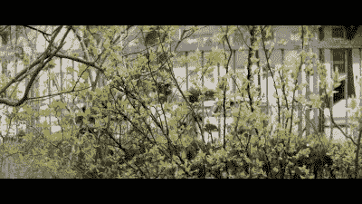

# 一个变形镜头适配器非常漂亮的视频

> 原文：<https://hackaday.com/2021/04/23/an-anamorphic-lens-adapter-for-very-pretty-video/>

变形镜头是一种很好的宽屏拍摄方式，但是对于数码格式来说太贵了。爱好者已经尝试使用旧投影仪的变形适配器镜头，但对焦可能是一件苦差事，效果不佳。[[Andrew]找到了一种方法，可以在现代相机上使用这些廉价的老式变形适配器，而不会牺牲太多的功能。](https://www.youtube.com/watch?v=RUUiCcsgbgM)

Pretty, no?

变形拍摄技术出现在电影时代。目的是在 3:2 宽高比的 35 mm 胶片上录制影院风格的宽屏镜头。这样做的方法是使用一个镜头挤压宽高比以适应格式，然后使用相应的镜头将其挤压回投影仪。这比简单地在 35 mm 的框架上进行信箱操作和浪费额外的空间能获得更高的分辨率。

亚当的黑客技术包括 3D 打印一个镜头外壳，将变形投影仪适配器镜头与索尼 E-mount 拍摄镜头配对。齿轮的设置使得两个镜头可以聚焦在一起，而不是典型的适配器设置，需要用户一次摆弄多个聚焦环。这使得装备在没有时间浪费的真实拍摄中更加有用。

这是一个有用的技巧，我们可以想象相当多的低成本电影制作人会争相复制。文件在 Thingiverse 上为渴望的人准备。休息后的视频。

 [https://www.youtube.com/embed/RUUiCcsgbgM?version=3&rel=1&showsearch=0&showinfo=1&iv_load_policy=1&fs=1&hl=en-US&autohide=2&wmode=transparent](https://www.youtube.com/embed/RUUiCcsgbgM?version=3&rel=1&showsearch=0&showinfo=1&iv_load_policy=1&fs=1&hl=en-US&autohide=2&wmode=transparent)

