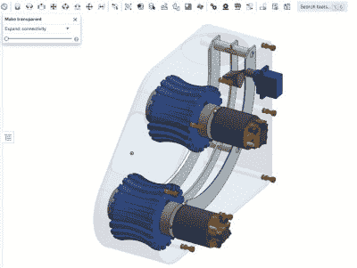

# 自动球发射器将是你的狗的新的最好的朋友

> 原文：<https://hackaday.com/2021/04/21/auto-ball-launcher-will-be-your-dogs-new-best-friend/>

如果有一个亮点是这个疫情，那就是我们和宠物在一起的额外时间。狗特别喜欢我们一直呆在家里，并且想把时间花在玩耍上，但是有时候你需要完成一些事情。为什么不带上你的笔记本电脑出门，用一个自动球发射器让狗狗开心呢？

 这是一项正在进行的工作，一旦全部完成，[康纳]计划发布一个 BOM 和 STL 文件。目前，[是一个工作原型，从外观上看，它将一个球射向空中，距离](https://www.reddit.com/r/arduino/comments/mtetzl/arduino_controlled_3d_printed_dog_ball_launcher/)约 25 英尺。足够有趣，但不至于越过围栏。

所有[康纳]要做的就是把球扔进顶部，你知道这将导致训练狗自己做这件事。一个接近传感器检测到球并启动一对 540 R/C 电机，然后一个伺服系统将球放入内部滑槽。马达通过一对由 Turnigy ESC 和 Arduino Nano 控制的异形 3D 打印轮以巨大的力量将球吐出。

在未来，[康纳]计划打印一个电子产品的封面，并扩大漏斗，以便狗更容易把球扔进去。休息后，查看简短的演示和构建视频。

所有的狗都应该能够随心所欲地玩捡东西的游戏，即使它们碰巧是瞎子。

 [https://www.youtube.com/embed/1KaSzXewymU?version=3&rel=1&showsearch=0&showinfo=1&iv_load_policy=1&fs=1&hl=en-US&autohide=2&wmode=transparent](https://www.youtube.com/embed/1KaSzXewymU?version=3&rel=1&showsearch=0&showinfo=1&iv_load_policy=1&fs=1&hl=en-US&autohide=2&wmode=transparent)

