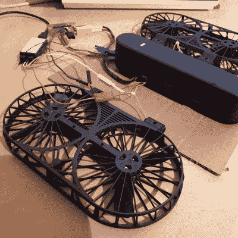

# 将逆向工程带上天空:廉价无人机获得 PX4 自动驾驶仪

> 原文：<https://hackaday.com/2021/04/24/taking-reverse-engineering-to-the-skies-cheap-drone-gets-px4-autopilot/>

有时候，坏软件是阻碍好硬件发展的唯一原因。[迈克尔·梅尔基奥]想为另一个项目收集一些马达和螺旋桨，所以他买了一架便宜的四轴飞行器，打算用它来做零件。[迈克尔]对他价值 100 美元的无人机中包含的硬件质量感到非常惊讶，他决定对他的四轴飞行器进行逆向工程，并对自动驾驶固件进行重大升级。

 拆开无人机后，【迈克尔】发现它附带了一个基于 STM32F405RG 的飞行管理单元，一个惯性测量单元，磁罗盘，气压传感器，GPS，WiFi 无线电，倾斜摄像头，光学流量传感器和超声波距离传感器，外加电池和充电器！飞行管理单元也有未填充的 SWD 头，尽管制造商的固件被保护不被读取，写保护也没有启用，所以[迈克尔]可以自由地刷新他自己的固件。

我们强烈推荐你[看看【迈克尔】的 *10 部分*逆向工程的杰作](https://mmelchior.wordpress.com/category/projects/simtoo-moment/)，其中包括一个中间人攻击，用树莓 Pi 来解决其 WiFi 通信，将[开源自动驾驶仪 PX4](https://px4.io/) 移植到新的机身，并破译未知的串行协议。甚至还有一些有趣的恶作剧，比如把电池放在烤箱和冰箱里，以帮助找出哪些寄存器被用作温度传感器。他在最后实现了起飞，我们迫不及待地想看看他在未来还能做些什么。

当然，[【迈克尔】对黑进口四轴飞行器](https://hackaday.com/2016/06/28/reverse-engineering-quadcopter-protocols/)并不陌生，如果你对 PX4 感兴趣，但想要比四轴飞行器更安静的东西，看看这款[配备自动驾驶仪的滑翔机。](https://hackaday.com/2019/03/27/running-a-glider-with-the-px4-flight-controller/)