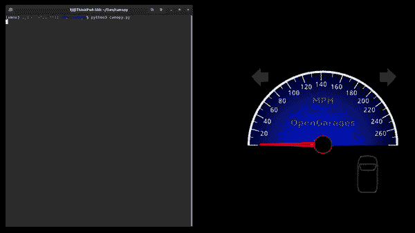

# 使用 CanoPy 可视化 CAN 总线

> 原文：<https://hackaday.com/2021/05/08/using-canopy-to-visualize-the-can-bus/>

随着汽车在电子方面变得越来越复杂，理解构成汽车数字系统主干的 CAN 总线对于黑客汽车变得越来越重要。廉价的微控制器 CAN 接口使得获取原始 CAN 总线流量变得轻而易举，但解释这种流量却颇具挑战性。为了更容易地可视化 CAN 流量，[TJ Bruno]开发了 [CanoPy，这是一个用于实时可视化 CAN 消息的 Python 工具。](https://tbruno25.medium.com/car-hacking-faster-reverse-engineering-using-canopy-be1955843d57)

一个基本的 PC CAN 接口简单地将总线的信息流量转储到终端，而更复杂的工具则按预定接收者的地址组织信息。这两种方法都以数字方式揭开引擎盖，让你检查你的汽车在想什么，但数字墙方法使找到掌握逆向工程关键的模式变得困难。使用 CanoPy 自动绘制数据使得查找相关性变得更加容易，之后可以使用基于文本的工具来关注几个特定的地址。

CanoPy being used to identify the speedometer’s CAN activity.

如果你想亲自尝试 CanoPy out，[【TJ】已经在 GitHub](https://github.com/Tbruno25/canopy) 上分享了它。你可能还记得[TJ]在他的[之前的指南中提到的用 Arduino](https://hackaday.com/2019/07/22/developing-an-automatic-tool-for-can-bus-hacking/)破解 CAN。