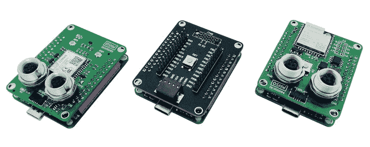

# 小型开源汽车黑客平台

> 原文：<https://hackaday.com/2021/04/25/small-open-source-vehicle-hacking-platform/>

[Florian]和他在慕尼黑的 BMC::labs 的工程团队开发了一套[智能原型板](https://hackaday.io/project/178815-bmcboard)，用于车辆黑客和快速产品开发，统称为 bmc::board 或 bmc::mini。这些可堆叠开发板最初是为内部使用而设计的。该团队采用通用方法进行设计，因此这些板可以用于各种项目，并且对该领域的任何人都有用。[Florian]决定向社区发布经过 OSHWA ( [开源硬件协会](https://en.wikipedia.org/wiki/Open_Source_Hardware_Association))认证的开源板。

目前已经定义了四个委员会，还有几个委员会正在工作中:

*   mini::base —基于 STM32F103 的主微控制器板
*   mini::out —带 CAN 总线、JTAG 等的 I/O 板。
*   mini::grid——提供 GPS 和 GSM 功能的 RF 板
*   mini::pit —本地无线连接、WiFi 和蓝牙以及第二个 CAN 总线

54 x 42.5 毫米，这些板相当小；这种外形被他们描述为“正好是半张信用卡”。我们喜欢他们使用的沃思 WR-MM 系列堆叠连接器，对称的引出线意味着你可以根据需要旋转卡。但乍一看，这些通孔连接器似乎将堆叠限制在两块板，尽管他们可能计划在未来的设计中采用 SMT 风格的连接器，允许更高的堆叠。

如果你对汽车电子和/或汽车黑客感兴趣，一定要看看这些。你可以查看【Florian】的 [bmc::board Hackaday.io 项目页面](https://hackaday.io/project/178815-bmcboard)和团队的 [GitHub 资源库](https://github.com/bmc-labs/board-mini)了解更多详情。这里是[团队成员【Sebastian】的另一个项目](https://hackaday.io/project/178872-k-line-to-can-converter)使用未来的 bmc::bike 模块之一来窃听 ECU 通信，他明智地建议读者“首先，靠边停车，从自行车上下来。千万不要在骑两轮车的时候黑它！”。

任何关于汽车 CAN 总线工具的讨论都不应该忽略克雷格·史密斯的工作，他写了一本关于黑客攻击你的汽车的书，他和 Hackaday 自己的 Eric Evenchick 在 2016 年的时候讨论过 T4。[Florian]已经开始了一个[众筹活动](https://www.crowdsupply.com/bmc-labs/board-mini)，在这里你可以看到这个项目的更多细节和一个简短的宣传视频。