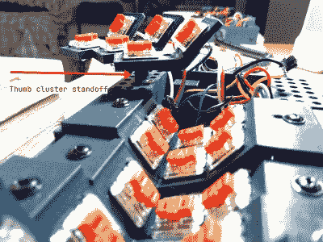

# 我们要去的地方不需要键帽

> 原文：<https://hackaday.com/2021/04/26/where-were-going-we-dont-need-keycaps/>

就在我们认为我们已经看到了符合人体工程学的分体式键盘的顶峰时，【Peter Lyons】推出了 Squeezebox——[这是一款可调节、列交错、流线型的产品，每只手有 21 个键](https://peterlyons.com/problog/2021/04/squeezebox-keyboard/)。就像 Kinesis Advantage 和 Dactyl 一样，用户的手指可以舒适地摆动，并保持在自然卷曲的位置，尽可能少地在键、行和列之间移动。但是 Squeezebox 走得更远，以减少手指的移动。

 对于初学者来说，每列按键都可以通过松开螺钉并滑动到合适的位置来在 Y 方向上进行调整。这些列在 Z 方向上也是可调整的，但是现在，这需要重新打印一些部分。如果你没有注意到，网格非常紧密，那些低调的 Kailh choc 开关对世界是裸露的，主要是因为键帽无论如何都不适合。

在那个角度，中间和底部的排之间根本不需要伸手。他们形成的 100 角既邀请又支持和弦——即同时按下多个键来做一些动作。也没有必要伸手去拿第一行，因为[Peter]只需将手指在 Z 方向向上移动一点点就能击中它们。类似角度的拇指簇也可以和弦，它们相对于大陆的位置是可调的，这要感谢一个网格孔，这意味着螺纹插入。天才！

在下一个版本中，[Peter]计划将三组拇指簇开关更紧密地放在一起，并将它们排列成一个三折的科学展展示板。请务必在构建日志中查看超级酷但有些难以焊接的原型，并在[巨大的构建图库](https://www.flickr.com/photos/focusaurus/50933955933/)中留下更多内容。打字演示在休息之后。

对你来说旅行还是太多了？每个手指来个 5 向怎么样？

 [https://www.youtube.com/embed/chsqAaH_KqI?version=3&rel=1&showsearch=0&showinfo=1&iv_load_policy=1&fs=1&hl=en-US&autohide=2&wmode=transparent](https://www.youtube.com/embed/chsqAaH_KqI?version=3&rel=1&showsearch=0&showinfo=1&iv_load_policy=1&fs=1&hl=en-US&autohide=2&wmode=transparent)

谢谢你的提示，[泰贝留斯总理]！