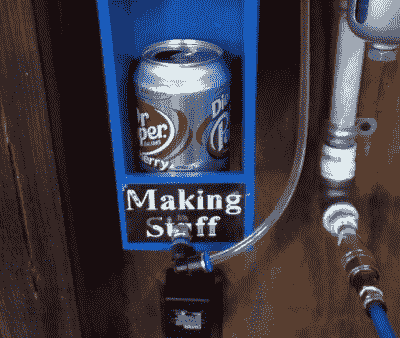

# 气动碎罐机等待您的命令

> 原文：<https://hackaday.com/2021/04/26/pneumatic-can-crusher-awaits-your-command/>

一个强大的机器人等待一个口头命令来粉碎它的敌人，这听起来像是科幻电影中的东西，但现在它是[制造材料]车库的永久固定设备。(视频，嵌在下面。)谢天谢地，这个机器人的死敌是铝罐，用声音控制它的人不是一个疯狂的科学家，只是一个认真对待回收利用的人。不管怎样，我们希望如此。

展览的明星是一台重型壁挂式罐头破碎机，它是由一些废钢和一个连接到车库压缩空气系统的气压缸制成的。一个电磁操作阀允许一个带有 ESP-01 的 Arduino 在适当的命令通过网络时伸展气缸。在这种情况下，目标是将粉碎机连接到谷歌助手，这样每当谷歌的监听设备听到触发短语时，罐头就会变小。

Note the ejector air line.

显然，那些宁愿将大数据放在回收站之外的人不必走上同样的道路。但话虽如此，必须给出特定的语音命令来激活机器确实提供了一定程度的操作安全性。至少相比于相信一些易贝传感器来区分铝罐和肉的附属物。

在用他的新玩具压碎了几个罐子后，[制造材料]注意到了设计中一个相当麻烦的缺陷。每当一个罐头被压碎，他就不得不把手伸进机器的肚子里，把它扁平的小躯体推出去。换句话说，他差一行代码就有一手好牌了。

解决方案最终是一个新的软管，从阀门的排气口到粉碎室:一旦气缸缩回，离开阀门的空气将粉碎罐推出机器的后部，进入下面的等待桶。非常圆滑。

即使你对语音控制方面不感兴趣，这也是一个很好的设计，可以作为你自己的碎罐器的基础。[虽然全自动破碎机的到来总是一件乐事](https://hackaday.com/2019/01/13/a-fully-automatic-electric-can-crusher/)，但我们承认，让一台机器可靠工作的挑战可能不值得这么麻烦。

 [https://www.youtube.com/embed/sxyYt7ofFGA?version=3&rel=1&showsearch=0&showinfo=1&iv_load_policy=1&fs=1&hl=en-US&autohide=2&wmode=transparent](https://www.youtube.com/embed/sxyYt7ofFGA?version=3&rel=1&showsearch=0&showinfo=1&iv_load_policy=1&fs=1&hl=en-US&autohide=2&wmode=transparent)

