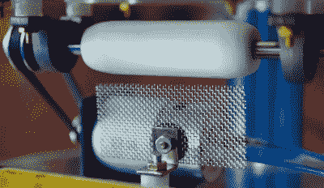

# 超大型范德格拉夫发电机组装一拳

> 原文：<https://hackaday.com/2021/04/27/supersized-van-de-graaff-generator-packs-a-punch/>

范德格拉夫发电机是科学博物馆的主要产品，即使普通人可能不知道它的名字，他们也很有可能熟悉“让你的头发竖起来的金属球”的描述。这部分是因为它们是展示高电压的一种相当安全的方式，但也因为它们出奇地便宜且容易制造。

在他最新的*等离子频道*视频[【杰伊·鲍尔斯】建造了一个大型范德格拉夫发电机](https://www.youtube.com/watch?v=nxagMrTVonQ)，放在博物馆或大学里也不会显得格格不入，他估计它能产生高达 50 万伏的电压。它可以轻松地抛出令人印象深刻的外观(和声音)火花 10 英寸或更长，正如你在下面的视频中看到的，它完全能够完成那些经典的科学博物馆把戏。

Lower pulley assembly.

看到范德格拉夫只用这么少的时间就能产生这种电压，真的很令人惊讶。事实上，里面没有什么你会立即等同于高电压，唯一的电子组件在发电机的基础上超过电池组是一个电机速度控制器。虽然其他一切看起来都像是魔术，但我们自己的(史蒂文·杜弗兰)写了一份关于这一切如何运作的科学解释。

在这种特殊情况下，电机旋转发电机底部的尼龙滑轮，该滑轮通过氯丁橡胶带连接到顶部的特氟隆滑轮。由细金属网制成的梳子靠近传送带的顶部和底部，使得范德格拉夫可以在球体中积累静电荷。顺便提一下，这听起来像是寻找大型金属球是整个建造中最困难的部分，因为[Jay]花了几个小时来修改花园凝视球，以适应作为机器核心的丙烯酸管的顶部。

在过去[我们已经看到范德格拉夫发电机由字面上的垃圾](https://hackaday.com/2013/01/04/van-de-graaff-generator-built-for-a-few-dollars/)建造而成，早在 2018 年，[【杰伊】自己就在这个概念上组装了一个更小更简单的](https://hackaday.com/2018/12/10/mini-van-de-graaff-is-a-shocking-desk-toy/)。但是这种美无疑提高了我们以前从未见过的标准。

 [https://www.youtube.com/embed/nxagMrTVonQ?version=3&rel=1&showsearch=0&showinfo=1&iv_load_policy=1&fs=1&hl=en-US&autohide=2&wmode=transparent](https://www.youtube.com/embed/nxagMrTVonQ?version=3&rel=1&showsearch=0&showinfo=1&iv_load_policy=1&fs=1&hl=en-US&autohide=2&wmode=transparent)

