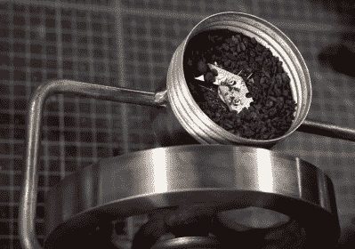

# 以机器商店的方式研磨咖啡豆

> 原文：<https://hackaday.com/2021/04/28/grinding-coffee-beans-the-machine-shop-way/>

好吧，所以你在潮人咖啡店买了一包味道好极了的单品咖啡豆，但是忘了磨碎。你是做什么的？如果你是吉米·迪瑞斯塔，你不可能跑到沃尔玛买一台 15 美元的研磨机。你和你的工具交流，花几个小时用车间里的材料做一个研磨机。

 只要我们还有办法加热水，这个手摇研磨机将会成为一个伟大的后世界末日时代的器具。[Jimmy]从一个旧的手动磨盘研磨机开始，像是研磨金属，而不是豆子。

在给它上油使其运行顺畅后，他拿出几个锥形齿轮，开始将其中一个安装到磨床轴上，另一个安装到老式工业灯具的商业部分。

我们认为这肯定会是一个毛刺磨床，但有点失望地看着[吉米]钻孔通过一个实用的刀片，以使刀片磨床。老实说，我们有点惊讶，他没有机器一些毛刺，但结果是令人印象深刻和可爱的。

我们喜欢整个东西从研磨机上快速断开，这要归功于一个定制的袖口，它可以固定住灯泡，所以我们只是希望[吉米]先把灯泡好好清洗一下。休息之后，随便拿一杯，看看构建视频。

不是你喜欢的那种商店？你可以随时打印一个应急咖啡研磨机。

 [https://www.youtube.com/embed/ErizFuwi3n4?version=3&rel=1&showsearch=0&showinfo=1&iv_load_policy=1&fs=1&hl=en-US&autohide=2&wmode=transparent](https://www.youtube.com/embed/ErizFuwi3n4?version=3&rel=1&showsearch=0&showinfo=1&iv_load_policy=1&fs=1&hl=en-US&autohide=2&wmode=transparent)

