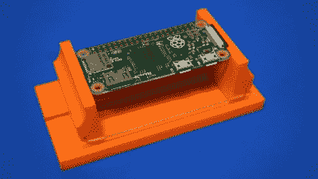
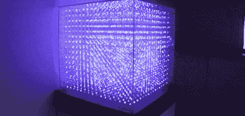
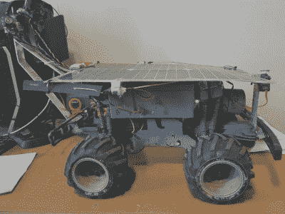
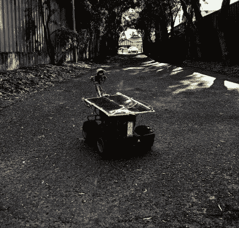

# 如何最好地让你的项目上黑客日

> 原文：<https://hackaday.com/2021/04/27/how-best-to-get-your-project-on-hackaday/>

我们很幸运在 Hackaday 有这样一个伟大的社区。我们的 tipline 经常充斥着各种各样的项目和构建。我们在这里看到了这一切，从刚刚开始使用第一个 Arduino 的初学者到在停机时间执行大胆复杂构建的顽固黑客，以及介于两者之间的一切。

如果你坐在看台上，敬畏地看着，你可能会想知道是什么美化了这些神圣的黑色书页。在生活中，没有什么是可以保证的，但我被特别授权与你分享一些技巧，可以最大限度地增加你在 Hackaday 上看到你的项目的机会。

## 首先:告诉人们你的工作

要写你的项目，首先我们必须能够找到它！不要害羞，[直接向黑客作家发送提示，告诉我们吧](https://hackaday.com/submit-a-tip/)！

我们喜欢与读者分享项目，这意味着他们也需要能够访问它们。因此，将你出轨的细节公之于众是关键。写你的项目的一个好地方当然是 [Hackaday.io](http://hackaday.io) ！对于*免费的很低很低的价格，*你可以张贴你所做的图片和细节。你的项目也可以参加很多有趣的竞赛。

但是，你看，任何地方，只要你能够以公开的方式发布完整的细节，都是可行的。基本上，如果它带有一个我们可以与每个人分享的链接，你就可以开始了！

## 一件简单的事情可以像一场精彩的表演一样有趣

A nifty gadget that helps out on the workbench is something of great value, even if it may not seem like the biggest deal when you’re making it!

如果你认为获得荣耀的唯一途径是拥有有史以来最惊人、最昂贵、最精彩、最独特的项目，这是情有可原的，但你大错特错了。你兴奋吗？我们也会的！

我们和其他人一样喜欢原创或令人印象深刻的建筑，但这并不是最重要的。解决人们每天面临的实际问题的面包和黄油项目也有很大的价值。例如，您的项目可能是重新发明车库开门器，但您也可能找到了一种巧妙的方法来完成它，或者找到了一种比以前更有用的方法。它也激发了阅读它的每个人的创造力，让他们从你的经历中受益，变得更加强大。所以，仅仅因为你的项目不是世界上第一个登陆冥王星的机器人，我们还是想看一看！

## 我们想要血淋淋的细节！

事实是，黑客作家也是人，就像你我一样。他们的任务是在野外寻找我们的读者想知道的酷项目。为了做到这一点，我们需要尽可能多的关于你的构建的信息。我们需要一个伟大的图像来捕捉项目的要点，我们希望尽可能演示视频。问问你自己，你是否已经充分回答了“什么”、“为什么”和“如何”。

什么很简单——是什么？它是一辆无线电控制的汽车吗？消防无人机？一个新的 Python 库，可以自动破解国会图书馆，为你不合时宜的啤酒派对创建一个折衷的 19 世纪 70 年代播放列表？你的项目帖子，或者视频，或者不管是什么，应该尽可能快速清晰地解释*什么是*项目。

We’re yet to find a specific purpose for LED cubes, but they’re undeniably cool. Often, that’s the best reason why!

为什么同样重要。当然，为什么的实质完全取决于你的判断力。我们由衷地接受“因为这很有趣”或“看看我们能不能”，就像我们接受“我讨厌我的配偶倒车进入信箱”一样。

“如何”是一个经常被遗忘的东西，但却是展示你作品中最有趣部分的关键。你可以有一个很棒的 mag-lev LED 球体视频，但如果你不解释这是如何做到的，它很可能会被忽略。Hackaday 文章不仅仅是说“嘿，看，这很酷”——我们是在学习新东西，并通过我们的工作互相教育。

## 图片比很多文字更有价值

A poor image of a project. The robot fills the entire frame, contrast is poor, and clutter means its difficult to make out what we’re looking at. Cropping this to several different sizes is impossible.

最后，图片真的很重要。黑客作家擅长使用一切可用的工具来哄骗甚至是最暗淡、最黑暗、剪裁最差的图像成为可用的文章标题，但即使是他们的精英才能也只能到此为止。没有标题照片，就没有文章，所以把这个做好是最重要的。

你能做的最好的事情就是有一系列展示这个项目的照片。只是不要忘记捕捉一个概览图像，显示项目在框架中心的构建。在项目的各个方向留出足够的空间，以便可以根据需要以各种方式进行裁剪。

A better project image. Clear contrast and plenty of space around the robot to give context and let us see all its important features. The framing makes it easy to get a 16:9 and a square crop out of the image. At 3024×2900, its nice and high res, too.

我们经常使用视频中的图像。如果你正在拍摄你的项目，我们喜欢有几秒钟的感兴趣的项目，很好的框架和良好的照明，缓慢或最小的相机运动。把那些迷人的照片放进你的视频中——你的观众会喜欢的，我们也一样！

当然，如果你的项目是代码，或者是一些不能可视化表示的东西，通常是可以采取措施的。例如，一个在 Python 中的 Raspberry Pi 上使用 GPIO 的新库可能会得到一个由相关徽标组成的图像，以快速向读者指示主题。如果你的项目属于这一类，你不必担心。但是对于其他的事情，*，*请拍一些好看清晰的照片，好好装裱！

## 最后的想法

总的来说，没有什么能保证这个世界会爱上你的项目，或者它会成为 Hackaday 的一页。我们不可能涵盖所有的事情，有时会有太多的事情发生(这是一个很大的问题)。如果您的项目没有被选中，您可以随时再次向我们发送链接，以防我们错过。

我希望你发现这有助于提示你彻底解释你的项目，并张贴它的优秀图像。我写这篇文章是为了帮助热切的黑客和开发者理解我们在一个伟大的项目中寻找什么，同时分享一些关于如何最好地向任何技术观众展示你的项目的通用技巧。总之，告诉我们什么，为什么，怎么做，告诉我们什么会让我们兴奋，你会走得很远。黑客快乐！