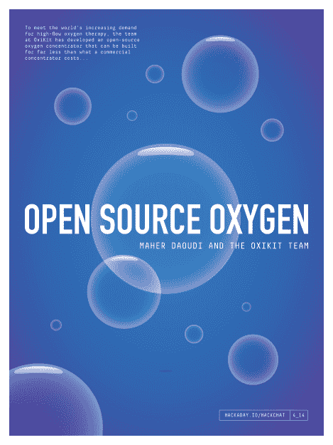

# 开源氧气黑客聊天

> 原文：<https://hackaday.com/2021/05/03/open-source-oxygen-hack-chat/>

加入我们太平洋时间 5 月 5 日星期三中午与 Maher Daoudi 和 OxiKit 团队的[开源 Oxygen Hack Chat](https://hackaday.io/event/179263-open-source-oxygen-hack-chat) ！

在如此动荡的时代，可能很难记住上周，更不用说去年了。但是，如果你往回挖掘一点，你可能会想起在 2020 年的这个时候，关于呼吸机危机，世界是多么的恐慌。随着新冠肺炎病例的增加以及大量患者需要重症监护的可能性，每个人和他们的兄弟都在组装临时呼吸机，他们善意地相信，他们的发明将有助于缓解这些救命的医疗机械奇迹的短缺。

然而，随着时间的推移，更多的新冠肺炎患者受益于高流量氧气治疗，而不是机械通气。在医用氧便宜且容易获得的地方，这是个好消息，但情况总是如此。我们已经看到最近关于印度医院缺氧的报道，甚至发达国家的农村和偏远地区也会发现他们没有足够的重要气体。

为了满足世界上对高流量氧气疗法日益增长的需求，OxiKit 公司的团队已经开发出了一种开源氧气浓缩器，这种浓缩器的成本远远低于商业浓缩器的成本。通过过滤空气中的氮气，浓缩器以高达每分钟 25 升的流量提供纯度为 90%或更高的氧气。

Oxikit 创始人 Maher Daoudi 和一些技术团队将加入我们的黑客聊天，讨论制造氧气浓缩器的细节。我们将了解他们是如何工作的，他们当前的浓缩器的设计过程是什么样的，以及他们是如何克服障碍并实现为大众提供高流量氧气的承诺的。

 我们的黑客聊天是 [Hackaday.io 黑客聊天群发消息](https://hackaday.io/messages/room/2369)中的社区直播活动。本周，我们将于太平洋时间 5 月 5 日星期三中午 12:00 坐下来讨论。如果时区束缚了你，我们有一个[方便的时区转换器](https://www.timeanddate.com/countdown/generic?iso=20210505T12&p0=224&msg=Open-Source+Oxygen+Hack+Chat&font=cursive)。

点击右边的那个发言气泡，你会被直接带到 Hackaday.io 上的黑客聊天群，不用等到周三；随时加入，你可以看到社区在谈论什么。

