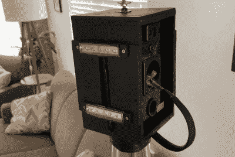

# 灯具兼作秘密环绕声扬声器

> 原文：<https://hackaday.com/2021/04/28/lamps-double-as-secret-surround-sound-speakers/>

结合今天的大规模平板显示器，一个好的环绕声系统可以为观看电影或游戏提供一个极其身临其境的环境。但是许多人遇到的绊脚石是扬声器的位置。前置扬声器通常位于电视的两侧，但为后置扬声器找到一个视觉和听觉都令人愉悦的位置可能会很棘手。

这就是为什么[Peter Waldraff]决定采取一种非常规的方法，将他的后置环绕声扬声器藏在一对正常工作的台灯中。这不仅比把扬声器放在外面看起来更好，而且可以把它们从地板上抬起来，放到一个更好的聆听位置。由于一些巧妙的布线，整个东西看起来非常光滑，以至于你永远不会怀疑它们不是普通的灯。

 这里的诀窍是位于组成灯体的三根铜管顶端的木盒。[Peter]将成排的发光二极管安装在盒子的侧面，可以通过底部的开关进行控制，在没有传统灯泡的情况下提供照明。未经修改的扬声器放在盒子里，连接到一根管道上的音频电线。

在底座中，扬声器和电源线捆绑在一起，因此看起来像一根电缆。由于像这样将电源线和音频线放在一起可能会产生嗡嗡声，因此[Peter]只将 12 VDC 电压通过灯连接到 led，并使用了外部“壁式”变压器。为了方便，他还在底座中央放了一个 USB 充电口。

当扬声器或环绕声系统经过我们身边时，通常是因为[某个黑客要么从零开始做了一套](https://hackaday.com/2020/04/18/3d-printed-speakers-with-many-lessons-learned/)，要么[给他们现有的设备](https://hackaday.com/2019/10/24/esp8266-unlocks-hidden-features-in-sound-bar/)增加了一些新的和改进的功能。与这些页面上的一些项目相比，这个项目可能有点低科技，但它无疑是一个聪明和意想不到的问题解决方案，这在我们的书中是一个黑客。

 [https://www.youtube.com/embed/MG09TxS1R-A?version=3&rel=1&showsearch=0&showinfo=1&iv_load_policy=1&fs=1&hl=en-US&autohide=2&wmode=transparent](https://www.youtube.com/embed/MG09TxS1R-A?version=3&rel=1&showsearch=0&showinfo=1&iv_load_policy=1&fs=1&hl=en-US&autohide=2&wmode=transparent)

