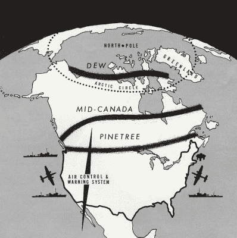
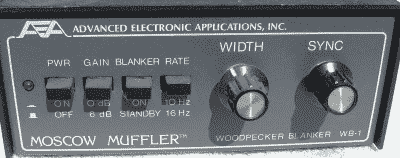
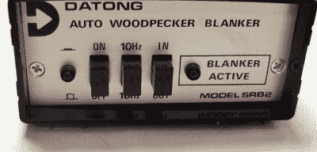

# 俄罗斯啄木鸟:冷战时期的官方鸟类，在巨大的天线上筑巢

> 原文：<https://hackaday.com/2021/05/11/the-russian-woodpecker-official-bird-of-the-cold-war-nests-in-giant-antenna/>

1976 年 7 月 4 日，当美国人用啤酒和瓶装火箭庆祝该国 200 周年纪念日时，一个强烈的信号开始干扰世界各地的短波、海事、航空和电信信号。信号是一种 10 赫兹的快速敲击声，听起来像啄木鸟或直升机在屋顶上发出的砰砰声。它具有 40 kHz 的宽带宽，有时超过 10 MW。

这是在冷战期间，许多人匆忙得出结论，这是某种苏联精神控制计划或天气控制实验。但业余无线电操作员追踪到这个神秘信号来自乌克兰切尔诺贝利(当时是苏联的一部分)附近的超视距雷达天线，他们将其命名为俄罗斯啄木鸟。这里有一段声音的剪辑。

跳频啄木鸟信号如此强大，以至于在某些频道上无法进行通信，当条件合适时，甚至可以通过电话线听到。几个国家通过联合国向苏联提出了正式投诉，但没有人能阻止俄罗斯啄木鸟。俄罗斯甚至不承认这个信号的存在，这个信号后来被追踪到一个巨大的天线结构，将近半英里长，490 英尺高，比吉萨大金字塔略高。

这座雄伟的钢结构矗立在普里皮亚季附近的辐射森林中，普里皮亚季是一座田园小镇，建于 1970 年，是切尔诺贝利核电站工人的住所。上图是发射器，也称为 Duga-1，切尔诺贝利-2，或 Duga-3，取决于你问谁。位于切尔诺贝利东北 30 英里处，在旧的苏联地图上，该地区被简单地标记为童子军营地。今天，这一切都在切尔诺贝利隔离区内。

这是一个秘密，政府否认它的存在，但全世界都听到了。这个庞大的装置是用来做什么的？

## 远程预警

[Duga 雷达是为了应对远距离预警线(DEW Line)而建造的两个发射器/接收器对之一，这是美国和加拿大联合建造在北极圈上方的少量天线。像任何](https://en.wikipedia.org/wiki/Duga_radar)[超视距雷达](https://en.wikipedia.org/wiki/Over-the-horizon_radar)一样，俄罗斯系统背后的理论是，莫斯科将有大约 25 分钟的时间以实物形式回应洲际弹道导弹，而不是只有大约 10 分钟的时间来躲避和掩护并与世界吻别。为了更好地了解这件事的规模，看看下面的视频中汤姆·斯科特的简短旅行。

The DEW, Mid-Canada, and Pinetree radar lines. Image via [Wikipedia](https://en.wikipedia.org/wiki/Distant_Early_Warning_Line)

超视距雷达依赖于一种类似的现象，这种现象为业余无线电提供了如此大的范围——信号从电离层反射回来，因此能够克服地球的曲率，这使它能够比标准的地面雷达更早地检测到发射。

在 2015 年的纪录片 [*俄罗斯啄木鸟*](https://www.youtube.com/watch?v=B556UXqyPcI) 中，一个由基辅艺术家带领的摄制组试图揭开天线的神秘面纱。他认为，切尔诺贝利核事故是精心策划的，目的是转移人们对这座建筑的注意力，因为它将接受即将到来的检查，但永远不会通过。

根据这部纪录片，Duga 天线的成本是切尔诺贝利核电站本身的两倍——约 70 亿卢布。将这一成本置于历史背景下是很棘手的。使用 [*财政部报告的 1976 年 6 月 30 日*](https://archive.org/details/treasuryreportin1976unitjun/page/n19/mode/2up) 的汇率，我们发现当时的汇率是 0.7550 卢布兑 1 美元。这使得 1976 年的成本约为 92.7 亿美元。经通胀调整后，2021 年的价值为 431.6 亿美元——这是一个令人难以置信的数字，让我们质疑这部纪录片的成本评估(以及我们自己转换过程的准确性)。

一些消息来源称雷达系统从未工作过。其他消息来源声称它确实如此，而且他们能够用它探测到每一次航天飞机的发射。当啄木鸟被报道干扰了俄罗斯的求救信号时，他们改变了频率。但在他们这样做之后，它因为北极光的干扰而停止了工作。

 [https://www.youtube.com/embed/xbi6eoh63ZQ?version=3&rel=1&showsearch=0&showinfo=1&iv_load_policy=1&fs=1&hl=en-US&autohide=2&wmode=transparent](https://www.youtube.com/embed/xbi6eoh63ZQ?version=3&rel=1&showsearch=0&showinfo=1&iv_load_policy=1&fs=1&hl=en-US&autohide=2&wmode=transparent)

## 制造莫斯科消声器

最终，公司和个人建立了屏蔽电路来屏蔽不断的窃听。传统的干扰消除电路通过寻找具有快速上升时间的短脉冲持续时间来工作，并产生信号来关闭信号路径中的门。但是这些对于淹没啄木鸟是没有用的，因为它们对低振幅脉冲不起作用。

The Moscow Muffler WB-1\. Image via [QRZ Forums](https://forums.qrz.com/index.php?threads/anyone-else-hearing-a-woodpecker-on-40m.411374/page-2#post-3049870)

熄灭啄木鸟信号的问题在于它的带宽很大，而且脉冲不一致。电离层反射会拉长脉冲，有时会产生回声，这就变成了打地鼠游戏。更糟糕的是，它们看起来经常像常规信号，这使得更难将啄木鸟从任何想要的信号中分离出来。

The Datong SRB2 Woodpecker Blanker. Image via [Radioworld](https://www.radioworld.co.uk/Second_Hand_Datong_Auto_Woodpecker_Blanker)

一种流行的设备是 AEA 莫斯科消声器，它通过产生 10 或 16 赫兹的内部信号来消除啄木鸟。但是如果电离层拉长了脉冲，就必须增加消隐脉冲的宽度来补偿，这通常意味着在混乱中丢失想要的信号。

另一个设备，大同 SRB2，更像是一个“设置好就忘了”的交易。SRB2 的工作原理很像莫斯科消声器，它产生一个内部时钟，并将其与啄木鸟信号进行比较。

SRB2 的奇妙之处在于它是自动的。一旦找到匹配，它就通过输入脉冲宽度、消隐脉冲的数量以及它们的理想位置来定制阻塞脉冲。相反，莫斯科消声器使用固定宽度的脉冲，所以你必须不断干扰它，以保持信号熄灭。

## 仍然站着，沉默着

俄罗斯啄木鸟干扰在 1989 年苏联解体后停止，大约在这个时候它的存在最终被苏联政府确认。那时，俄国人已经开始使用卫星进行早期预警。

2013 年，[一个类似的信号开始恐吓短波](https://mattsworldowonders.blogspot.com/2014/09/the-woodpecker-returns.html)，尽管没有最初的那么强烈。据信，它来自一种新的俄罗斯 OTH 雷达系统，名为[集装箱](https://en.wikipedia.org/wiki/Container_radar)，看起来几乎和 Duga 一样大。如果你想了解一下，[调到短波](https://mattsworldowonders.blogspot.com/2014/09/the-woodpecker-returns.html)的 14.270，让我们知道你听到了什么！

【主图来源:[杜加雷达天线](https://commons.wikimedia.org/wiki/File:Duga-1_radar_panorama_20160326-IMG_2434.jpg)，人类为尺度。图片由 Corsairoz [CC BY-SA 4.0](https://creativecommons.org/licenses/by-sa/4.0/)