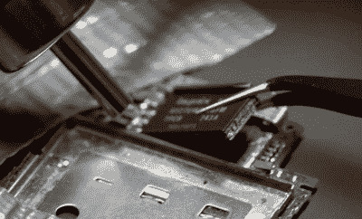

# 在 IPod Nano 3G 上存储更多音乐的史诗般的探索

> 原文：<https://hackaday.com/2021/05/02/an-epic-quest-to-put-more-music-on-an-ipod-nano-3g/>

虽然许多人会认为最初的 iPod 是苹果多年来发布的众多数字音频播放器中最具标志性的产品，但第三代(3G) iPod Nano 肯定会有一些考虑。这是一款在许多方面都领先于其时代的设备，今天仍然完全可用，尽管[【塔克·奥斯曼】确实认为它可以将其最大闪存存储增加一倍，达到 16 GB](https://www.youtube.com/watch?v=5zk2CDQ5N9A) 。

现在，我们想告诉你，他已经成功地完成了这项任务。毕竟，从理论上讲，这应该非常简单:只需移除 8 GB 闪存芯片，并替换为引脚兼容的 16 GB 版本。但是当然，我们谈论的是苹果。没有什么事情是那么容易的，而且看起来 13 岁的 iPod 的硬件和软件都在抵制这种变化。

 在最初的闪存芯片被换出之前，人们进行了几次尝试，但最终[塔克]和他的朋友[卫斯理]成功地换出了一个芯片。不幸的是，他们的努力只能显示一个无用的错误屏幕。

从这里开始，假设他们正在处理一个软件问题。幸运的是，Rockbox 引导程序之前已经被移植到 3G Nano 上，这有助于启动这个项目。下一步将是修补 Nano 的固件以接受新闪存芯片的 ID，但经过一年的工作，结果是一个比这更复杂的*位*。

[塔克]还没有放弃，正在积极寻找愿意帮助他完成任务的人。他在 Hackaday.io 上与一些志同道合的人分享了一些信息，他还启动了一个致力于纳米黑客的 [Discord 服务器](https://discord.com/invite/bah8hgkTQs)。在这一点上，听起来他已经非常接近真正从 16 GB 芯片中读取数据了，但距离 Nano 的固件真正播放音乐还有很长的路要走。

尽管现在大多数人都用智能手机来播放音乐，但我们仍然看到很多人对 iPod 的升级和现代化感兴趣。从[用微型 SD 卡替换他们原来的硬盘](https://hackaday.com/2018/03/30/giving-a-6th-generation-ipod-a-new-lease-on-life/)到[安装树莓派 Zero 代替原来的电子设备](https://hackaday.com/2021/01/27/raspberry-pi-zero-powers-spotify-streaming-ipod/)，黑客们仍然迷恋苹果传奇的媒体播放器。

 [https://www.youtube.com/embed/5zk2CDQ5N9A?version=3&rel=1&showsearch=0&showinfo=1&iv_load_policy=1&fs=1&hl=en-US&autohide=2&wmode=transparent](https://www.youtube.com/embed/5zk2CDQ5N9A?version=3&rel=1&showsearch=0&showinfo=1&iv_load_policy=1&fs=1&hl=en-US&autohide=2&wmode=transparent)

