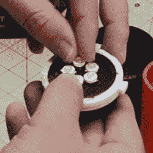
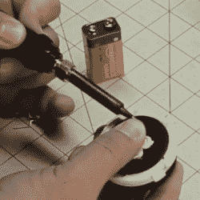

# 100%印刷手电筒:导电灯丝和熔化引线

> 原文：<https://hackaday.com/2020/08/31/100-printed-flashlight-conductive-filament-and-melted-in-leads/>

导电细丝并不是理想的电导体，但它是一种 3D 打印的导体，这就是[Hercemer]的[使用导电细丝的 3D 打印手电筒的工作原理。除了 9 伏电池和发光二极管，手电筒的每个部分都是印刷的。从电学角度来说，手电筒是少量并联到电池端子的 led，打开或关闭它是通过扭动或松开盖子来建立或断开连接。](https://www.thingiverse.com/thing:4577938)

该建筑的主要部分是一个 3D 打印的导电圆柱体，周围是一个印刷的导电环，其间有一个绝缘体。这种盘状或垫状组件不仅形成了发光二极管和电池端子之间的电连接，而且还物理地固定了发光二极管。为了连接它们，[Hercemer]简单地把它们融进去。他用烙铁加热导线，趁热将它们压入 3D 打印的导电块中。当端盖扭转时，9 V 电池的端子接触底部，当它们接触导电组件时，手电筒打开。

Anode of each LED goes to the center, cathodes to the outside ring.

LED leads are melted-in with a soldering iron.

9 V battery pressed to the bottom of the conductive block lights up the LEDs.

预计到每个人的好奇心，[Hercemer]测量了他的导电块的电阻，当以 90%的填充率印刷时，测量值大约为 350 欧姆；更低的填充导致更大的阻力。你可以看到一个视频的组装和观看手电筒在视频中的行动，嵌入下面。

 [https://www.youtube.com/embed/mEYGW7PR6gE?version=3&rel=1&showsearch=0&showinfo=1&iv_load_policy=1&fs=1&hl=en-US&autohide=2&wmode=transparent](https://www.youtube.com/embed/mEYGW7PR6gE?version=3&rel=1&showsearch=0&showinfo=1&iv_load_policy=1&fs=1&hl=en-US&autohide=2&wmode=transparent)

LED 引线的热设置非常巧妙，可以根据需要安装各种 LED。这很像[黄铜热镶件，它与 3D 打印塑料](https://hackaday.com/2019/02/28/threading-3d-printed-parts-how-to-use-heat-set-inserts/)配合得很好，并且可以在类似的构造中实现良好的电气连接。