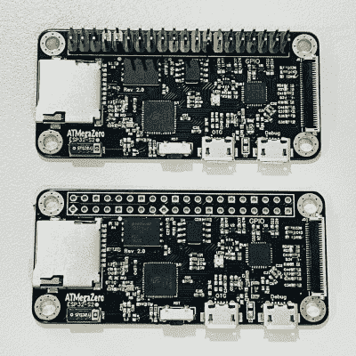

# 看起来像一个 Pi Zero，实际上是一个 ESP32 开发板

> 原文：<https://hackaday.com/2021/04/30/looks-like-a-pi-zero-is-actually-an-esp32-development-board/>

ATMegaZero ESP32- S2, showing optional color-coded 40-pin header (top)

ATMegaZero ESP32-S2 目前正在 GroupGets 上接受一项活动的资助，这是一个模仿 Raspberry Pi Zero 外形的微控制器板。这意味着它不是我们大多数人都知道和喜欢的嵌入式 Linux 系统，而是一个基于 ESP32 的开发板，具有与 Pi Zero 相同的形状和 40 引脚 GPIO 头。此外，它还有一些简洁的功能，如用于廉价的 SSD1306 和 SH1106 有机发光二极管显示器的连接器。

能够使用现有的附件可以大大简化项目的创建，利用这一点是共享 Pi Zero 外形的原因之一。易用性也是目标之一，因此这些板将配备 [CircuitPython](https://circuitpython.org/) (源自 [MicroPython](https://micropython.org/) )，也可以与 Arduino IDE 一起使用。

如果使用 Pi Zero 外形的微控制器板看起来有点熟悉，您可能会记得基于 Atmel ATMega32U4 的原始 atmega Zero T1，但要获得无线通信，需要连接一个单独的 ESP8266 模块。这种较新的板保留了 ATMegaZero 的名称和足迹，但现在使用 [Espressif ESP32-S2](https://www.espressif.com/en/products/socs/esp32-s2) 来提供所有必要的功能。

[CircuitPython 已经成为各种项目和黑客攻击的一项功能](https://hackaday.com/tag/circuitpython/)我们在 Hackaday 上看到，这是一种让微控制器板开箱即用的好方法。