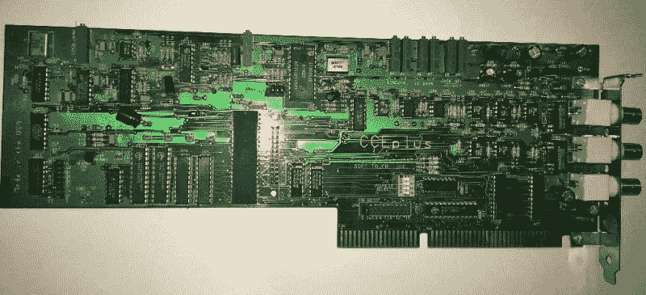
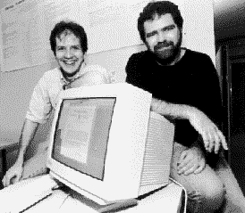
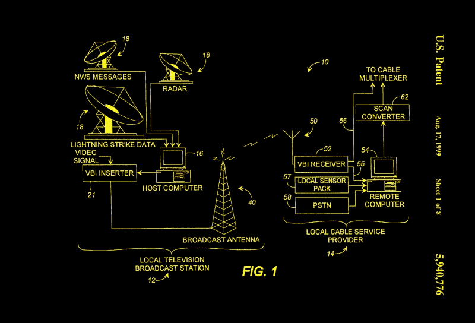
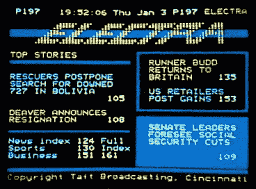
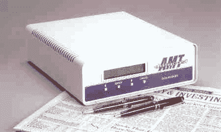
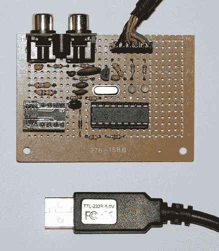
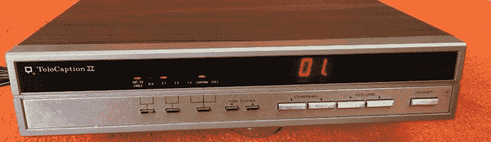
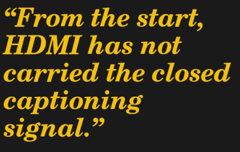

# 隐藏字幕的历史:进入数字时代

> 原文：<https://hackaday.com/2021/05/27/history-of-closed-captions-entering-the-digital-era/>

当你想阅读电视节目、电影或视频时，你可以打开字幕。在引擎盖下看看这些文字是如何传递的是一个迷人的故事，它始于一种称为隐藏字幕的技术，并扩展到另一种称为字幕的技术(可以说是更古老的技术)。

在我之前的一篇关于隐藏字幕模拟时代的文章中，我提到了这两者之间的区别以及它们的背景故事。今天我想进入故事的另一个迷人的章节:随着数字时代的到来，隐藏式字幕发生了什么变化？从光盘媒体上的特殊实现到深奥的解码硬件和 HDMI 令人困惑的怪癖，这是一个奇妙的故事。

上次在评论区有一些很棒的问题，希望我在这里已经回答了大部分。让我们从隐藏式字幕和垂直消隐间隔(VBI)数据的一些非标签用途开始。

## VBI 数据的非预期用途

当我沉浸在 VBI 数据和隐藏字幕的世界中好几年的时候，我不断发现与预期用途无关的应用程序。

#### 新闻室频道监视器

过去，我发现了一家小公司，名为 [SoftTouch，Inc.](http://www.softtouch-inc.com) ，据其所有者 Doug Byrd 称之为“过时的创新者”。他们做了各种小众市场 CC 产品，其实我今天还有几个他的产品。最有价值的是两张 [CCEPlus](http://www.softtouch-inc.com/ccep.htm) line 21 发电机卡，这是我唯一拥有的全长 ISA 卡，它给了我一个借口，让我在我的实验室保留一个完全正常工作的 Gateway 2000 486DX2-66V 超过 15 年。

Full Length ISA Card Closed Caption Decoder

这些年来，我很喜欢和道格打电话。他很有个性，很会讲故事，我从他那里学到了很多关于字幕行业的知识。虽然他的利基产品被用于各种系统，但让我印象深刻的是新闻室。想象一下这样一个系统，它被设计用来监控一面装有 CC 解码器的电视墙(或者只是调谐器),这些解码器将 RS-232 文本输入计算机，计算机被编程为寻找各种关键字，并在找到时向工作人员发出警报。事实上，大约十年前，我们在 Hackaday 上写过一个类似的项目。

#### 西班牙语实时翻译

Popowich and McFetridge at Simon Fraser in 1998

我偶然发现的一个令人惊讶的应用是一个小机顶盒，它是为喜欢看美国日间肥皂剧的西班牙人翻译英语对话而设计的。这是一个有趣的项目，有两个方面。西蒙弗雷泽大学的研究人员弗雷德波波维奇和保罗麦克菲特里奇开发了一种“摇动并烘烤”的机器翻译算法[，这种算法可以在当今的硬件中实现](https://www.nytimes.com/1998/07/23/technology/news-watch-set-top-television-translator-to-provide-spanish-captioning.html)。它大约有 80%的准确性，但是他们发现了一些有趣的事情。80%对于只会说西班牙语的人来说很好，但是会说双语的人对这些错误很恼火。

#### DVD 字幕的字典查找

一天晚上，我在烧酒的时候和一些韩国工程师朋友讨论隐藏式字幕和 DVD 字幕，得知有一家韩国公司生产专门的 DVD 播放器。这款播放器的特别之处在于它有一个内置的 OCR 引擎来读取字幕(而不是字幕)，并为用户提供翻译和定义——它旨在成为一款语言教育产品。它不进行实时 OCR 翻译，而是在用户按下暂停键向机器寻求帮助时进行 OCR。

#### 天气雷达数据分发

虽然图文电视主要在欧洲使用，但 WST 标准包含了 NTSC 国家的变体，即北美广播图文电视规范(NABTS ),也称为 EIA-516。哥伦比亚广播公司和全国广播公司都尝试了图文电视服务，但并不流行。然而，数据广播能力确实在其他方面找到了一些牵引力。早在 21 世纪初，当我学习 VBI 信号时，我发现了一个令人惊讶的应用。我与美国当地气象雷达公司的一名工程师交谈，发现他们正在 VBI 上空广播气象数据和雷达图像，为各种应急准备小组提供帮助。他甚至借给我一个 NABTS 接收器，我把它安装在我的电脑上，可以从我的桌子上监控实时数据。令我惊讶的是，他告诉我电视台正在出租 VBI 线。例如，在像纽约这样拥挤的市场中，甚至可能没有空的线路。

Datacasting Weather Radar Data over the VBI

#### 财务数据

Electra Teletext Sample

也不仅仅是天气雷达数据人员在使用 VBI。许多数据广播服务涌现出来，它们使用 VBI 来发布股票和商品价格等金融信息。有几个网络在运行，有些是从 20 世纪 70 年代末开始的。它们包括 [DTN 实时](https://web.archive.org/web/19980626173332/http://www.dtn.com/finserv/realtime/)、[伊莱克特](https://en.wikipedia.org/wiki/Electra_(teletext))和节奏文本。到 20 世纪 90 年代中期，所有这些服务都关闭了，互联网取代了时间敏感型数据广播的角色。

VBI Data Receiver

#### 扩展数据服务

隐藏式字幕标准最终被修改为包括所谓的扩展数据服务，或 XDS。这些辅助数据由 field 2 VBI 传送，包括时间、V-chip 等级、电台 ID 和基本编程信息等信息。一些早期的电子节目指南(EPG)如 Guide Plus 是通过 VBI 发送的。XDS 还有一个紧急警报部分，它可以在指定的时间内宣布各种天气和其他紧急情况，一直到州和县地区。

# 今天制作第 21 行解码器

正如我在[关于模拟隐藏字幕的文章](https://hackaday.com/2021/04/14/history-of-closed-captions-the-analog-era/)中提到的，在 21 世纪制作模拟隐藏字幕解码器最好不要依赖专门的一体化 IC。这种接收机需要三种功能:

*   与视频信号同步
*   对数据进行切片/阈值处理
*   处理协议

令人惊讶的是，同步到传入的视频是一个真正的挑战。这是因为 Macrovision 复制保护方案。VBI 中插入了野脉冲，表面上是为了防止磁带录音(这些脉冲搞乱了 VCR 的 AGC 电路)。当然，想做副本的人，就造了或者买了一个宏视抑制盒。但如果你想可靠地同步到 Macrovision 加载的视频，这并不简单。

我考虑过自己做，但是有很多特殊情况。也有一些法律方面的考虑，但我与 Macrovision 的工程师联系过，并不太担心。最终，我选择了一款兼容 Macrovision 的同步分离器，它经过了设计和测试，可以在比我在测试中所能再现的更广泛的 Macrovision 场景中工作。

Build Your Own CC Decoder Project

有各种方式对第 21 行数据进行切片。我基于一个聪明的开源项目成功地构建了几个电路板。Richard Ottosen 和 Eric Smith [发表了一个使用微芯片 PIC16F628 的漂亮设计](http://www.brouhaha.com/~eric/pic/caption/)，随后由 [Kevin Timmerman](http://www.compendiumarcana.com/vbi/) 对其进行了扩展。这些设计充分利用了 PIC 的内部比较器:一个用作峰值检测器，另一个用于数据阈值处理。如果你对制作自己的解码器感兴趣，可以看看这些。

从解码器获得数据后，处理数据可能会很麻烦，这取决于你希望自己的设计有多精确。读者[unwiredben]在之前的文章中评论说，最近编写一个全新的实现是多么有趣。我完全同意。一个问题是需求分散在不同的文档中。其中一些在 2000 年几乎无法获得，但它们构成了 FCC 法规中规定的官方法律要求。

我尤其记得有一段非常艰难的时间，一份是 PBS 要求的报告，另一份是国家字幕研究所的报告。不是因为他们不合作，而是因为这些报告太旧了，他们找不到。(我最终得到了这些报告，还有一个真正的 Telecaption II 字幕解码器，许多最终规范都是基于它。)

Telecaption II External Decoder Box

我记得的一个事件是试图购买一套 CC 验证磁带。据说它们可以从 WGBH Boston 买到，但当我打电话时，似乎已经多年没有人要它们了，他们也不确定还有没有了。他们最终找到了剩下的一套，并把它运到了韩国这里，在这里，它几乎在海关被销毁，因为一些模糊的法律禁止进口预先录制的媒体。需要考虑的一点是，如果您只是想提取文本进行分析，那么处理过程会比您还想在屏幕上正确显示和定位文本容易得多。

可以构建一个数字 CEA-708(见下文)解码器。如果你对此感兴趣，我在下面的评论区放了几个链接。

## 字幕的制作

制作标题文本的过程太复杂了，无法在这里介绍。简而言之，对话必须被转录成数字格式。在新闻或体育赛事等实时字幕的情况下，技术、技能和设备都是从法庭记者的世界里带来的。在预录节目的情况下，该过程可以由脚本来辅助。但是他们仍然需要和演员们所说的话进行核对。接下来，添加任何额外的线索，然后对话必须被分解成块，这些块需要在屏幕上正确定位，并与音轨同步。

如果你有兴趣了解这方面的更多信息，请访问加里·罗布森的网站。他不仅讨论了制作字幕的过程，而且 Gary 已经在字幕行业工作了很长时间，并写了几本关于这个主题的优秀书籍。我读了他们所有人的书，并在一些场合寻求他的建议——一个非常好的、知识渊博的家伙。

## 字幕和数字视频

到目前为止，焦点一直是用于空中广播的模拟隐藏式字幕，或多或少也用于有线电视广播。但是我们看待节目的其他方式呢？在 VHS 磁带的情况下，幸运的是，如果不是设计者所预料的，21 号线信号可以很容易地被录像设备记录和回放。然后出现了像激光光盘、DVD、蓝光光盘和流媒体这样格式的数字视频，字幕的世界分崩离析了——至少在一段时间内。

#### 向数字化过渡

首先我们有激光唱片。他们存储和播放 NTSC 和 PAL 格式的字幕。这里没什么大问题，但请耐心等待。接下来是数字多功能光盘(DVD)，隐藏式字幕开始变得模糊不清——这种情况或多或少持续到今天的 DVD 和蓝光光盘(BD)。DVD 规范专门调用用户数据包来存储字幕数据的数字对(作为数字数据，不在视频行中编码)。虽然我不知道为什么 PAL DVD 不能做到这一点的任何技术原因，但只有区域 1(北美)NTSC 光盘可以存储字幕数据，并且仍然符合规范。

大多数 DVD 播放机使用这些数据在视频输出信号上生成一个模拟 line 21 信号，然后在观众的控制下由电视机的内部 CC 解码器对其进行解码。

*   复合视频输出
*   s-视频输出:
    *   在 Y/亮度信号上
*   分量视频输出:
    *   如果是 RGB，则在绿色/同步信号上
    *   在 Y 通道上，如果 Y/Pb/Pr

很少有播放器能够真正解码字幕数据，并将其作为开放式字幕叠加到输出视频上，但这些播放器是例外，而不是常态。

#### 我们有一个问题…

你可能会看到这是什么意思——在第 21 行隐藏字幕中有一个隐藏的假设。根据定义，它们只存在于隔行扫描的标准清晰度视频中(在 NTSC 的情况下为 480i)。虽然没有技术上的理由不这样做，但没有任何商定的标准来为任何其他视频定时通过 VBI 发送数据。在 20 世纪 70 年代，没有人想到这一点。

这导致购买高清电视和 DVD 或 BD 播放器的消费者感到不安，他们发现除非他们以 480i 模式观看节目，否则无法观看闭路字幕数据。但是，如果你使用隐藏字幕，在 NTSC DVD 区域 1 内直播，并且满足于观看 480i 标准模式的节目。一切都好吗？不完全是。

出于某种原因，我仍然不明白，不是所有预先录制的 DVD 都包含隐藏字幕，即使电影有字幕，也可以在同一工作室发布的 VHS 磁带上找到。这似乎是随机的，只有一个例外——环球影城的 DVD 从来没有隐藏字幕。别担心，DVD 技术为这个问题提供了一个“新”的解决方案——字幕。还记得 1900 年代早期的那些吗？

因为现在一切都是数字化的，DVD 和 BD 可以提供老式的硬拷贝字幕，但有所改变。用户可以打开和关闭它们，并且经常可以从更广泛的语言中进行选择(CC 通常仅限于两种语言，如果有的话，还有那些从狭窄的语言选择中选择的语言)。设计字幕的自由几乎是无限的——因为它们只是带有透明背景的图片，可以包含任何内容。在一些光盘上看到英文和英文 CC 字幕并不少见。

尽管许多资料来源声称相反，BD 光盘可以而且确实带有 21 行字幕。在过去的十年里，我一直使用 BD 和 BD 播放器测试 21 号线的信号，没有出现任何问题。但捕捉与 DVD 相同，它们只在 480i 标准清晰度模拟输出中产生。字幕光盘的缺乏甚至比 DVD 更糟糕——我估计不到三分之一的 BD 有字幕。我上面提到很少有 DVD 有内部 CC 解码器。我想我从来没有见过一个 BD 玩家带着它。

#### 数字电视

负责隐藏式字幕标准的行业工作组意识到需要做一些事情来将字幕带入数字时代。该小组开发了新版本的隐藏式字幕，解决了模拟字幕用户群体的许多问题。回想一下，模拟标准是 EIA-608。新标准被称为 CEA-708 (CEA 在 2011 年关闭时从 EIA 中分离出来)。除了与 ATSC 数字广播兼容的格式之外，增加的一些功能包括:

*   真正的多语言支持
*   不同的字体大小
*   不同的字体样式
*   可以在屏幕上重新定位
*   传统 EIA-608 功能

随着数字电视广播成为规范，电视机被能够解码新的 708 风格字幕的电视机所取代。你的电视机今天大概也有这个能力。

## 基带数字视频和字幕

我们的电视和显示器质量迅速提高。高清模拟分量信号很快被高速数字差分信号取代。存在各种标准，但 HDMI 已经成为消费者视频的事实上的数字视频接口。我们的电视机正在接收高清数字节目，能够解码和显示新式字幕。这个世界一切都好。嗯，没那么快。

 人们肯定会期待一种全新的标准，如 HDMI，从头开始设计以支持消费者 A/V 设备之间所有当前和可想象的通信类型，来处理隐藏式字幕信号的琐碎带宽和格式。嗯，你会失望的——有人没收到备忘录。从一开始，HDMI 就没有传送隐藏式字幕信号。人们认为这是一个故意的决定是可以理解的，因为标准已经更新了无数次，HDMI 电缆仍然不能传输隐藏字幕。

业内人士的解释是，随着数字技术的发展，字幕解码现在必须在机顶盒中进行。如果这些盒子也提供带有 EIA-708 字幕的 ATSC 调制 RF 频道输出，类似于旧计算机和 VHS 播放器的 Ch 2/3 输出，这可能不是太糟糕的选择。事实上，依赖隐藏字幕的消费者现在有两个或更多解码器可以摆弄:一个在电视的高清数字接收器中，一个在有线机顶盒中，第三个可能在他们的 DVD/BD 播放器中。

## 联邦通信委员会力挽狂澜？

随着从预录媒体到流媒体的转变，这种情况真的失控了。联邦通信委员会介入并解决了这个问题。你可能会认为，像 EIA-708 这样已经建立的现有标准，已经在电视机中使用，并由 FCC 强制要求所有广播公司使用，合理的答案是要求流媒体服务也使用 EIA-708。并且可能鼓励 HDMI 组织也携带隐藏式字幕信息。唉，这不是我们的决定。相反，联邦通信委员会规定，流媒体服务可以使用任何他们希望的字幕技术标准，只要他们能够提供字幕。

我觉得这种状况不太理想。回顾模拟隐藏式字幕的所有巧妙和非故意的使用，我想知道由于缺乏统一的字幕标准，我们错过了多少新颖的创新。或者说，我们有意决定不统一应用现有的字幕标准。也就是说，我不希望我对技术细节的抱怨分散我们对全局的注意力。这些法规的真正目标是为聋人和重听人群体提供字幕，这些法规适用于所有的节目交付方式。那真是太好了。