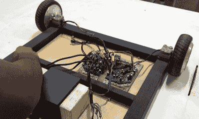

# 悬浮滑板转向重型遥控漫游车

> 原文：<https://hackaday.com/2021/05/03/hoverboard-turned-heavy-duty-remote-control-rover/>

它们可能不是我们在*回到未来 II* 中承诺的悬浮滑板，但占据了这个名字的流行电动滑板车以其自己的方式成为令人兴奋的科技产品。这并不是因为我们想通过骑自行车来出丑，而是因为它们充满了有用的硬件，由于规模经济和二手市场，这些硬件非常便宜。

在他的最新视频中，足智多谋的[【maker man】将一对悬浮滑板变成了一个功能强大的遥控移动平台](https://www.youtube.com/watch?v=Rw8INdMi7Yo)非常适合……嗯，你想移动的任何东西。它的焊接钢结构当然适合一些重型任务，虽然我们不能说我们会用它来牵引 SUV，如下面的视频所示，但很高兴知道我们可以选择。

 该项目从将四个车轮马达从踏板车上解放出来开始，并小心地切割车架以保存安装硬件。这些支架最终被焊接到漫游者的框架上，一块钻石板被拧紧在顶部。在底部，[MakerMan]安装了两个控制板和一个定制的 36 V 电池组。

他没有详细说明如何将 RC 硬件与电机控制器连接起来，但正如我们在过去的黑客攻击中看到的那样，[这些电路板](https://hackaday.com/2020/05/06/hoverboard-becomes-kart-in-easy-build/)有开源固件替代物，允许它们由外部输入控制。大概这里使用了类似的东西，但是我们有兴趣听听其他的。当然，如果你想制造某种自主漫游车，你可以用微控制器或 Raspberry Pi 替换 RC 硬件。

难道周围没有电焊工或方便收集的废钢吗？别担心。多产的修补匠[【Aaron Christophel】使用螺栓铝挤压将非常相似的东西组装在一起](https://hackaday.com/2019/08/24/hacked-hoverboards-become-potent-rc-tank/)。

 [https://www.youtube.com/embed/Rw8INdMi7Yo?version=3&rel=1&showsearch=0&showinfo=1&iv_load_policy=1&fs=1&hl=en-US&autohide=2&wmode=transparent](https://www.youtube.com/embed/Rw8INdMi7Yo?version=3&rel=1&showsearch=0&showinfo=1&iv_load_policy=1&fs=1&hl=en-US&autohide=2&wmode=transparent)

