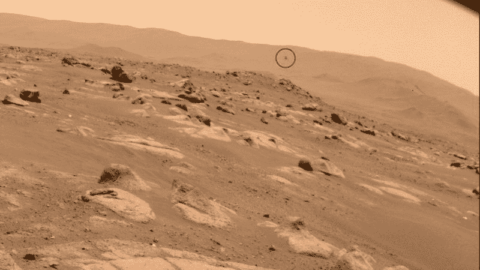

# 独创性完成第四次火星飞行，获得新的任务

> 原文：<https://hackaday.com/2021/05/02/ingenuity-completes-fourth-flight-on-mars-gets-a-new-mission/>

火星上和这里一样——就在你开始习惯自己的工作时，老板们来了，改变了一切。

至少这是我们对 Jezero 陨石坑情况的解读，在那里,[火星创新直升机刚刚升级并延长了它的任务。在](https://mars.nasa.gov/news/8936/nasas-ingenuity-helicopter-to-begin-new-demonstration-phase/)[周五上午的新闻发布会上](https://www.youtube.com/watch?v=BAlXe-U0ws4)，由毅力小组成员和一些美国宇航局官员参加的创新飞行小组宣布，创新已经赢得了额外的 30 sols 飞行时间，并将从纯粹的“技术演示”阶段过渡到“操作演示”阶段。他们还宣布了独创性的第四次飞行，今天圆满结束，覆盖 266 米，在空中停留 117 秒。

Fourth flight of Ingenuity (circled), captured by Perseverance rover. Source: NASA/JPL

任务延期有两个主要驱动因素。首先，在证明直升机可以在火星大气中飞行并自主操作方面，独创性已经实现了为其设定的所有技术目标。在这样做的过程中，独创性收集了大量的数据集，这些数据集将为未来行星探索无人机的设计提供信息。但仅此还不足以证明延长任务期限是合理的。独创性总是一个附加物，旨在尽可能少地占用毅力号主要任务的资源，毅力号的主要任务是收集样本，寻找火星上的古代生命。该计划是让火星车留在创新号附近，支持 30 个 sol 的飞行操作，然后前往更有趣的 Jezero 陨石坑区域探索和收集样本。

但事实证明，正如毅力号的仪器所显示的那样，行星科学家对独创性操作区域周围的区域，即莱特兄弟场，远比最初预期的更感兴趣。这为漫游者提供了一个机会，让它暂时留在原地，进行一些采样和科学研究，并仍然支持创新号现在已经扩展的任务。

我们发现这是一个令人兴奋的发展，我们期待着来自现在重叠的独创性和毅力的任务的数据和图像。为了了解更多关于这些神奇的航天器，请查看我们对漫游者本身和它的同伴直升机的深入探索。

[编者按:NASA 任务延期几乎是标准操作程序。机遇号火星车设计了三个月，却跑了 15 年！哈勃太空望远镜仍在*做科学研究。为什么？这很复杂，但是[我们有话要说](https://hackaday.com/2019/03/11/engineering-for-the-long-haul-the-nasa-way/)。]*