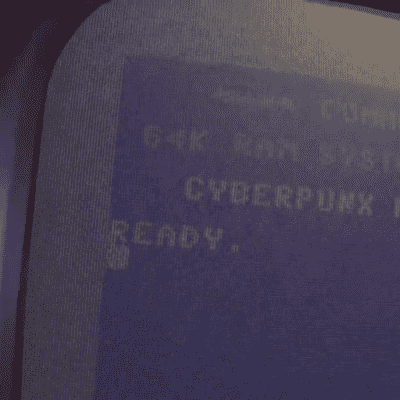

# 虚拟现实中的 Commodore 64 模拟器提供完整的 80 年代体验

> 原文：<https://hackaday.com/2021/05/03/commodore-64-emulator-in-vr-delivers-a-full-80s-experience/>

The simulated color CRT monitor looks surprisingly convincing in VR.

在不拥有硬件的情况下玩老式硬件的一种方法是使用模拟器，但 [[omni_shaNker]宣布通过使用虚拟现实将它提升到一个新的水平，推出一个完整的 Commodore 64 系统，在其全盛时期](https://www.reddit.com/r/oculus/comments/n1nsau/commodore_64_in_vr_see_comments_for_details/)，配有一个原生的 80 年代 habitat 玩具组！对于模拟老式硬件来说，这是一个非常有趣的角度，尤其是因为模拟器与 VR 中看起来非常令人信服的 CRT 监视器效果相匹配，更不用说虚拟的 5.25 英寸软盘驱动器可以发出令人信服的真实声音。

该项目[托管在 GitHub](https://github.com/petermg/VRC64) 上，支持各种 VR 硬件，但对于 Oculus 头戴设备的所有者来说，[该应用程序也可以在 sidquest](https://sidequestvr.com/app/1036/real-commodore-64-virtually-oculus-go)上获得最大的便利。SideQuest 本质上是一个用于管理软件的帐外应用程序商店，这些软件既没有得到脸书的批准，也没有发布。Oculus 归脸书、[所有，脸书热衷于牢牢控制他们的硬件](https://hackaday.com/2020/11/03/as-facebook-tightens-their-grip-on-vr-jailbreaking-looks-more-likely/)。

尽管该应用程序功能强大，但仍有改进和优化的空间。为了解决这个问题，[omni_shaNker]在 Reddit 上发布了[号召测试者，所以如果你感兴趣，一定要联系。下面还嵌入了充满技术细节的视频演示和概述；一定要给它一个手表，看看这个项目是怎么回事。](https://www.reddit.com/r/OculusQuest/comments/n3cacn/beta_testers_needed_for_app_real_commodore_64/)

 [https://www.youtube.com/embed/e4WtXQKV6W4?version=3&rel=1&showsearch=0&showinfo=1&iv_load_policy=1&fs=1&hl=en-US&autohide=2&wmode=transparent](https://www.youtube.com/embed/e4WtXQKV6W4?version=3&rel=1&showsearch=0&showinfo=1&iv_load_policy=1&fs=1&hl=en-US&autohide=2&wmode=transparent)

