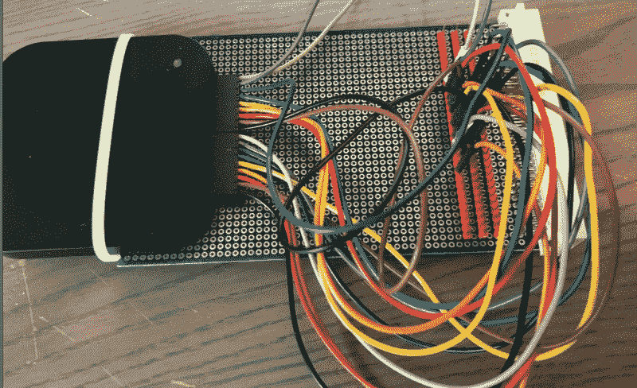

# VME 逆向工程

> 原文：<https://hackaday.com/2021/05/05/vme-reverse-engineering/>

在等待延迟部件到来的空闲时间里，[里克]着手对他获得的一个旧 VME 系统进行逆向工程。 [VMEbus](https://en.wikipedia.org/wiki/VMEbus) 电脑基于标准的 [Eurocard](https://en.wikipedia.org/wiki/Eurocard_(printed_circuit_board)) PCB 格式，该格式定义了各种卡的尺寸——最常见的是 6U 高，就像[Rik]的系统。它们通常由一个带有无源背板的机架安装式卡盒组成。最初，基于 Motorola 68000 的 CPU 卡用于 VMEbus 系统，但只要您向系统总线提供正确的信号和时序，任何处理器都可以使用。欧洲卡系统现在不太常见，但仍在一些应用中使用。事实上，如果你喜欢合成器，你今天可能会使用 euro card——[euro rack 标准](https://en.wikipedia.org/wiki/Eurorack)基于标准的 3U 卡尺寸。

回到[Rik]的项目，他不知道这个系统是什么，也不知道如何使用它。经过一番探索，他发现了两个 UARTs，一个系统监视器，以及一种加载和转储 S 记录文件的方法。他很好地记录了这一过程，因为系统的内部布局和内存图是一点一点解开的。我们也喜欢他检测 VMEbus 信号的方法——如今的逻辑分析仪非常小，你可以在机架内安装一个。

剧透警报:[Rik]成功映射出内存，用 68k 汇编语言编写了一些小程序，甚至还构建了自己的 LED 附件卡，这样他就可以闪烁一些灯(这是一个人必须做的)。

我们[最近写了关于模块化的文章](https://hackaday.com/2021/04/27/ask-hackaday-why-make-modular-hardware/)，VMEbus + Eurocard 系统就是模块化设计的好例子。您可以使用完全现成的卡快速组装一个健壮的组件，或者混合您自己的定制卡。但是时钟速度和小型化方面的技术进步使得这些卡笼无源背板系统越来越不适用。你们中有人还在使用 VMEbus 吗，或者你们过去有没有使用它进行设计？请在下面的评论中告诉我们。