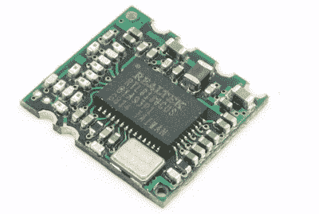

# 把一个超小的 Linux 板放进手机充电器…最终

> 原文：<https://hackaday.com/2021/05/06/putting-an-ultra-tiny-linux-board-in-a-phone-charger-eventually/>

在安全专业人员中，“投件箱”是一种可以秘密安装在目标位置并通过互联网呼叫总部的设备，它提供了一个进入本应安全的网络的后门。我们已经看到了这个概念的商业和 DIY 版本，正如你所料，其中一个主要目标是让设备看起来尽可能不显眼。这就是为什么 [[Walker]希望将它做成一个标准的 USB 壁式充电器](https://machinehum.medium.com/im-putting-a-wifi-router-into-a-wall-charger-part-0-2c1e1a80ccde)。

这个项目仍处于早期阶段，但我们喜欢我们目前所看到的。[Walker]的目标是使这成为一个 100%免费的开源设备，从他用来制作 CAD 文件的工具一直到最终硬件将运行的固件。由于目前可用的单板计算机(SBC)都不能满足他的要求，第一步是建立一个微型 Linux 机器，它有足够的处理能力在本地运行有用的安全工具。显然，这样的一个板会引起更大的黑客和制造者社区的极大兴趣。

The RTL8188CUS is likely to get integrated later on.

到目前为止，[Walker]已经决定了他的主要组件，并正在开发一个更大的开发板，然后才真正全力以赴地进行小型化过程。截至目前，他正计划使用 Allwinner A33 为主板供电，这是一种低于 10 美元的芯片组，在低成本 Android 平板电脑中最常见。

A33 拥有 1.2 GHz 的四核 Cortex-A7，并提供 USB、I2C 和 SPI 接口进行扩展。它将配有 1 GB 的 DDR3 内存和一个 SD 卡来存储操作系统。像这样的设备自然需要 WiFi，但在[沃克]决定使用哪种芯片之前，计划是只使用 USB 无线适配器。Realtek RTL8188CUS 是一个强有力的竞争者，因为它有 USB 和模块两种版本，这一事实应该使其最终的集成无缝。

即使你对在日常物品中隐藏安全设备的想法不感兴趣，这个项目也是对创建你自己的定制 Linux 板的过程的一次迷人的一瞥。无论你是在寻找一个壁疣还是一个无人机，很难想象我们已经达到了一个人可以旋转自己的微型 SBC 的地步。