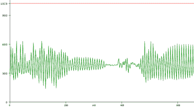

# Arduino Nano 上的语音识别？

> 原文：<https://hackaday.com/2021/05/26/speech-recognition-on-an-arduino-nano/>

像我们大多数人一样，[Peter]在隔离期间有一点额外的时间，他决定回顾一下 20 世纪 70 年代的语音识别技术。很快，他开始思考，“嗯…我想知道我是否可以用 Arduino Nano 做这个？”我们可能都有类似的想法，[但是【Peter】真的把他的理论付诸了实践](https://www.instructables.com/Speech-Recognition-With-an-Arduino-Nano/)。

硬件本身非常简单。有一个 Arduino Nano 来运行语音识别算法，还有一个 MAX9814 麦克风放大器来捕捉语音命令。然而，[彼得的]方法的美妙之处在于他的软件实现。[Peter]在他编写的定制 PC 程序和 Arduino Nano 之间有一点互动。他的算法的学习方面是在 PC 上完成的，但实现是在 Arduino Nano 上实时完成的，[这是部署在微控制器上的任何机器学习算法的典型方法](https://hackaday.com/2020/12/04/remoticon-video-how-to-use-machine-learning-with-microcontrollers/)。为了捕捉样本音频命令或话语，[Peter]首先必须优化 Nano 的 ADC，以便获得足够的采样率来进行语音处理。做了一点低级编程，他实现了 9ksps 的采样率，[这对于音频处理来说已经足够快了](https://en.wikipedia.org/wiki/Sampling_(signal_processing)#Sampling_rate)。

为了分析话语，他首先将每个样本话语分成 50 毫秒的片段。想象一下把一个单词分成不同的音节。比如分析“seven”中的“se-”与“-ven”分开 50 毫秒可能太长或太短，无法清晰地捕捉到每个音节，但希望这能让你对[彼得的]程序正在做的事情有一个很好的了解。然后，他计算了每段话语的 5 个不同频带的能量。通常情况下，这是使用傅立叶变换来完成的，但是 Nano 没有足够的处理能力来实时计算傅立叶变换，所以 Peter 尝试了一种不同的方法。相反，他实现了 5 组数字带通滤波器，使他能够更容易地计算每个频带中的信号能量。

然后，每个频段的能量被发送到个人电脑，在那里，一个定制的程序根据他生成的样本话语创建“模板”。他的算法的关键是比较每个话语(和每个片段)的每个频带的能量与模板的接近程度。PC 程序产生一个. h 文件，可以直接在 Nano 上编译。他使用了能够识别数字 0-9 的例子，但是如果你愿意，你可以把这些命令改成“开始”或“停止”。

[Peter]承认，你无法在 Arduino Nano 上实现我们期望从那些[秘密监听设备](https://hackaday.com/2021/02/02/alexa-stop-listening-to-me-or-ill-cut-your-ears-off/)中获得的语音识别类型，但他提到小型免提设备，如头戴式万用表，可以受益于一个单词或一个短语的语音命令。[也许这可以让你放心](https://hackaday.com/2019/01/17/win-back-some-privacy-with-a-cone-of-silence-for-your-smart-speaker/)知道你说的一切不会立即被传送到云端，给我们的人工智能统治者。[或者也许我们都开始习惯这个](https://hackaday.com/2016/12/19/how-has-amazon-managed-to-make-hackers-love-alexa/)。不管你对人工智能的现状持什么立场，希望[你能为你的下一个项目](https://hackaday.com/2021/05/18/2021-hackaday-prize-rethink-refresh-and-rebuild/)获得一些灵感。