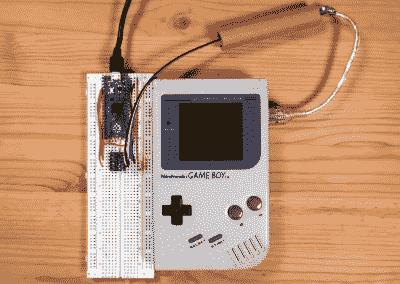

# 游戏男孩俄罗斯方块获得在线多人游戏

> 原文：<https://hackaday.com/2021/05/10/tetris-for-game-boy-gets-online-multiplayer/>

1989 年发布的 Game Boy 版 *Te* *tris* 因其是第一款通过所谓的“游戏连接线”配件支持多人游戏而闻名。因此，32 年后，同样的游戏[现在可以通过互联网与其他人一起玩，这要归功于【stacksmashing】](https://gumroad.com/l/gb-link)的开源 USB 适配器。

正如下面的视频中所解释的那样，适配器本质上只是一个与一些电平转换器配对的 Raspberry Pi Pico，以便它可以与 Game Boy 的链接端口对话。也就是说，定制 PCB 确实实现了一些非常智能的边缘连接器，让您可以将其直接插入最初的“brick”Game Boy 以及后来的 Color 和 Advance 变体的链接电缆。这使你不必为了得到一个公端而切断连接电缆，而这正是[stacksmashing]在原型制作阶段必须做的。

The DIY breadboard approach works as well.

当然，硬件只是等式的一半。还有一个开源软件栈，其中包括一个 Python 服务器和 WebUSB 前端，用于处理与 Game Boy 的通信和连接玩家。虽然最初的游戏只支持两人对战模式，但多人游戏相对简单的本质允许[stacksmashing]用他的代码将它扩展到任意数量的玩家。核心规则没有改变，每个客户端游戏玩家仍然认为这是两个玩家的比赛，但网络界面会显示其他玩家的进度，以及谁最终领先。

需要澄清的是，这不是某种透明的 TCP/IP 解决方案的链接电缆。虽然这种事情在硬件上有可能实现，但截至目前，软件[stack mashing]只适用于俄罗斯方块。因此，如果你想在网络上与口袋妖怪战斗，你必须自己做逆向工程(或者至少等待别人不可避免地做这件事)。

Game Boy 上的链接电缆端口[，尤其是在硬件](https://hackaday.com/2020/04/21/esp32-refines-game-boy-bluetooth-adapter/)的较新版本上，是一个令人惊讶的多功能接口[，它不仅仅能够进行多人游戏](https://hackaday.com/2011/08/11/adding-a-midi-input-to-a-game-boy/)。虽然我们当然渴望看到[stacksmashing]进一步开发这个项目，但我们同样兴奋地看到这种易于使用的计算机界面在标志性手持设备上的非游戏应用。

 [https://www.youtube.com/embed/KtHu693wE9o?version=3&rel=1&showsearch=0&showinfo=1&iv_load_policy=1&fs=1&hl=en-US&autohide=2&wmode=transparent](https://www.youtube.com/embed/KtHu693wE9o?version=3&rel=1&showsearch=0&showinfo=1&iv_load_policy=1&fs=1&hl=en-US&autohide=2&wmode=transparent)

谢谢马克的提示。]