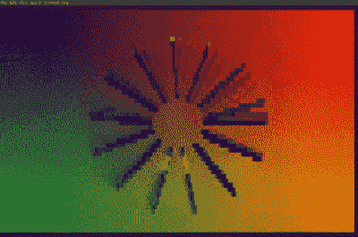

# PHP 有了自己的演示引擎

> 原文：<https://hackaday.com/2021/05/09/php-gets-a-demoscene-engine-of-its-very-own/>

当我们想到 demoscene 时，我们首先想到的通常是 80 年代的电脑，尤其是 Commodore 64 和 Amiga 500，它们被广泛认为是他们那个时代最棒的电脑。然而，你可以在任何你想要的平台上写一个演示，[和【OxABADCAFE】已经做到了——用 PHP。](https://www.youtube.com/watch?v=koEwVBM4a3U)

Pretty, no?

PDE，意为无意义、可移植或 PHP 演示引擎，[好奇者可以在 GitHub 上找到代码。](https://github.com/0xABADCAFE/php-demo-engine#pde-the-pointlessportablephp-demo-engine)代码设置为 RGB ASCII 终端输出，具有漂亮的老派美感。演示序列可以在 JSON 文件中编程，如果没有提供内置的演示，代码将执行默认的内置演示。

还没有音频，所以你必须冷却你的重击 chiptune 喷气机，直到在以后的版本中可用。也就是说，我们期待更多的开发来扩展引擎的功能——毕竟，[没有什么比挑战极限](https://hackaday.com/2015/04/10/demoing-an-8088/)更有说服力的了。休息后的视频。

 [https://www.youtube.com/embed/koEwVBM4a3U?version=3&rel=1&showsearch=0&showinfo=1&iv_load_policy=1&fs=1&hl=en-US&autohide=2&wmode=transparent](https://www.youtube.com/embed/koEwVBM4a3U?version=3&rel=1&showsearch=0&showinfo=1&iv_load_policy=1&fs=1&hl=en-US&autohide=2&wmode=transparent)

【感谢无用座机的提示！]