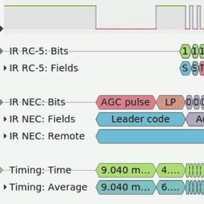

# 重新发明轮子

> 原文：<https://hackaday.com/2021/05/08/reinventing-the-wheel/>

你已经有了一个完美的软件库来做你想做的事情。你为什么不用它？你们中的一些人已经在叫嚷什么国家卫生研究院综合症或者重新发明轮子——我听到了。但至少有时，有一个足够好的理由来重新发明轮子:假设你想学点东西。

Mike 和我在播客上谈论一个很酷的黑客:一个库，它可以让一个软盘驱动器和一个 Arduino 一起工作，甚至可以为它构建一个极简的 DOS。只有一件事[大卫·汉瑟]没有独立完成，那就是编写《肥胖图书馆》;他用的是【Elm-ChaN】的 [FatFS](http://elm-chan.org/fsw/ff/00index_e.html) 。Mike 漫不经心地提到，他一直想从头开始编写自己的 FAT 库，只是为了了解它在基础层面上是如何工作的，我甚至没有眨一下眼睛。见鬼，如果我有时间，我也想这么做！

 在 Hackaday 上四处看看，你会看到大量的人们重新发明轮子的 hacks。在这个[高超的 soundbar hack](https://hackaday.com/2021/05/02/soundbar-bested-by-virtual-android-bluetooth-sniffer/) 中，【Michal】花了一段时间手工编写 IR 协议，直到屈服于[IRMP 的调用](https://github.com/ukw100/IRMP/)，一个为你做好一切的库。但是如果你读了他的文章，你会发现他并不悲伤；他学到了一些红外协议。这个 [I2C 纸带阅读机](https://hackaday.com/2021/05/03/i2c-paper-tape-reader-is-not-what-you-think)如果不是 I2C 转轮的重新发明，那就什么都不是，但这难道不是最好的学习方式吗？

是的，它是。回想一下你上一堂课。老师或教授肯定会合理详细地向你解释一些事情——毕竟这是工作。然后你有一些自己要做的作业，你做了，即使你可能只是在重复教授和无数其他人已经经历过的东西。但是通过自己动手，即使是“重新发明轮子”，你也学到了材料。我敢打赌如果没有。

当然，当关键时刻到来，最后期限迫在眉睫的时候，也许是时候加入那个可靠的库了。但是如果你真的想自己学点东西，你完全有权利重新发明轮子。

This article is part of the Hackaday.com newsletter, delivered every seven days for each of the last 200+ weeks. It also includes our favorite articles from the last seven days that you can see on [the web version of the newsletter](https://mailchi.mp/hackaday.com/hackaday-newsletter-649368). Want this type of article to hit your inbox every Friday morning? [You should sign up](http://eepurl.com/gTMxQf)!