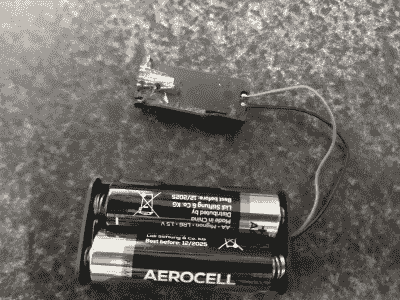

# 咖啡必须流动:更换咖啡机中用过的锂电池

> 原文：<https://hackaday.com/2021/05/11/the-coffee-must-flow-replacing-a-spent-lithium-cell-in-a-coffee-machine/>

当[hacky]买了一个二手的 Douwe Egberts Gallery 200 多功能一体咖啡机时，人们知道这台机器有一个“空电池”。作为一个花式咖啡机，从咖啡豆的研磨到热水和蒸汽的应用，它依赖于每一个咖啡配方的说明。不幸的是，正如[hacky] [在荷兰 Tweakers 论坛的友好人士](https://gathering.tweakers.net/forum/list_message/67221960)的帮助下发现的那样，这台机器将这些存储在电池支持的 SRAM 中。

Douwe Egberts Gallery 200 是一款更名机器，在斯堪的纳维亚也以 Wittenborg FB 5100 的名称出售。这些机器有一个 ST [M48T58](https://www.st.com/en/clocks-and-timers/m48t58.html) 计时器模块，结合了 8 kB 的永久 SRAM 和实时时钟。由于由单个硬币电池供电(锂碳一氟化物化学)，它们的寿命是有限的。

Replacing the coin cell in an M48T58 TimeKeeper module with AA cells.

Fortunatley 在背面提供了一个 DE-9 连接器，以便对硬件进行维修/维护。使用方便可用的硬件编程指南，很容易计算出引脚排列和波特率(9600，8 位，忽略奇偶校验，无流量控制)。这允许对 SRAM 进行重新编程，但是如果不更换电池，该数据将在下一次启动时再次丢失。

根据 ST M48T58 数据表，尚不清楚包含硬币电池和晶体的夹式模块是否可以更换，尽管人们可以简单地插入新的 M48T58 模块。或者，就像[hacky]所做的那样，也可以切开“SNAPHAT”的顶部，并在替换电池模块中布线。由于两个 1.5V AA 电池向模块提供 3V 电压，模块再次运行。

下一步:想办法把什么写到 SRAM 中，让咖啡重新流动起来。