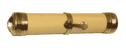
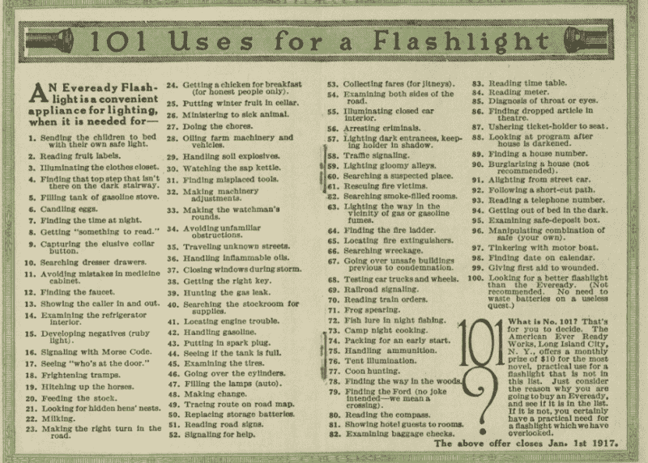

# Everready 手电筒历史的 101 种用途

> 原文：<https://hackaday.com/2021/09/29/101-uses-for-an-everready-flashlight-history/>

出于某种原因，我总是对事物为什么被称为它们本来的样子感兴趣。例如，过去我被迫研究什么是 Absorbine Senior。并不是说这很重要，但 Absorbine Junior 是一个较小尺寸的马擦剂，所以你不必买一桶普通的 Absorbine 只是为了按摩你疼痛的拇指。因此，我会发现自己在思考为什么我们称手电筒为手电筒，这并不奇怪。

至少在正常情况下，你不会认为手电筒在闪光。事实证明，答案在于这个设备的历史，它糟糕的开端，以及我们对待不完美组件的意愿，就好像它们比现在好得多。顺便说一下，最后一点在今天仍然有影响，所以即使你不是手电筒历史的爱好者，请继续阅读。

## 移动式照明

自从人们学会用火，就有了对便携式照明的渴望。火把、蜡烛，甚至油灯都有自己的位置。但是在狭小拥挤的空间里燃烧东西来照明还有很多不足之处。当电力似乎可行时，人们很快转向电力，这并不奇怪。

然而，要制造一个好的便携式灯，你需要一个好的电池和好的灯泡。这两件事都不会马上发生。特别是早期的电池，具有湿化学性质。它们很重，需要保持直立。

手电筒由【Belb】，CC-By-2.5 仿制

1887 年，使用糊状电解液的干电池开始出现。大规模生产的单位直到 1896 年才出现。到 1899 年，英国发明家大卫·米赛尔申请了一项美国专利，这项专利被认为是一种现代手电筒。纸管中的几个 D 电池加上一个灯泡和一个反射器创造了一个干净的便携式光源。

专利受让人——美国电气新奇和制造公司——向纽约市警察局捐赠了一些设备。他们留下了深刻的印象，但酒吧是相当低的，我们不会认为这些灯今天。不过，该公司确实取得了成功，并最终以 EverReady 而闻名。

你会注意到，即使在早期的广告中，也会出现“手电筒”这个词。事实证明，低质量的电池和灯丝共同创造了一个不会持续很长时间的灯。开灯几乎立刻导致电池电压下降。结果是你会得到一点闪光，它会立即变暗，直到你让电池休息一秒钟。

## 更好的一切

当然，说到电子产品，随着时间的推移，一切都会变得更好。钨丝帮了大忙，电池技术也变得更好了。如今，甚至连白炽灯泡都不常见了，因为固态灯泡通常更好。如果你找到一个普通的灯泡，它可能充满了氙气。

Part of a flashlight pamphlet

尽管如此，干净、凉爽的便携式灯还是有它的用处。到了 20 世纪早期，你可以找到手电筒的 101 种用途，并且有各种各样的不同类型可供选择，正如你在这本小册子中看到的。

## 电路

即使在今天，灯泡也是一种奇怪的电路元件，需要特殊处理。我们喜欢将它们视为具有稳定特性的纯阻性负载，也喜欢将电池视为理想的电压源。当然，这些都不是真的。

当你试图给白炽灯泡供电时，至少会发生两件事。首先，真正的电池并不完美。因此，虽然您可能认为电池看起来像一个完美的 1.5 V 电池，但它实际上更像一个串联了小电阻的完美电池。电池越好，电阻越小，对电路性能的影响越小。

例如，假设电池的内阻为 1/4 欧姆。此外，想象一下，你有一些(目前)理想的灯泡，在 1.5 V 时消耗 1.5 mA，这意味着它应该看起来像一个 1000 欧姆的电阻。

如果你在模拟器中查看类似于的[电路，你会发现没有太大区别，因为 1/4 欧姆与 1K 相比是如此之小。但是，如果你研究一下这些数字，你会发现随着比率变小，进入负载的电压和电流的影响会有所不同。](https://tinyurl.com/yecyr6nv)

## 更多问题

实用手电筒的另一个问题是灯丝不太像电阻。灯丝在冷的时候会有一定的电阻值，但是加热的时候电阻值会迅速增加。当您施加比标称工作电流高出许多倍的功率时，这种电阻变化会导致浪涌电流。

当您试图直接从数字输出驱动真正的灯泡时，这可能是一个常见的问题。初始浪涌电流可能会对额定足以正常工作的输出造成严重破坏。在一些设计中，灯泡的可变电阻[被用作设计参数](https://hackaday.com/2020/06/23/eico-signal-generator-gets-a-repair/)。

所以所有这些东西结合起来给了我们手电筒。一种高电阻电池，当质量差的灯丝产生高浪涌电流时，电池就会下垂。幸运的是，我想，任何光即将到来。

当然，现在的手电筒是不会闪的，除非你想让它闪。有充气灯泡、发光二极管、激光——甚至我们的手机都有专用的手电筒钥匙。有些手电筒有很多发光二极管。或者，你可以选择[更少的发光二极管](https://hackaday.com/2010/08/20/1w-blue-laser-remarkably-easy-and-dangerous/)但更多的——嗯——能量。